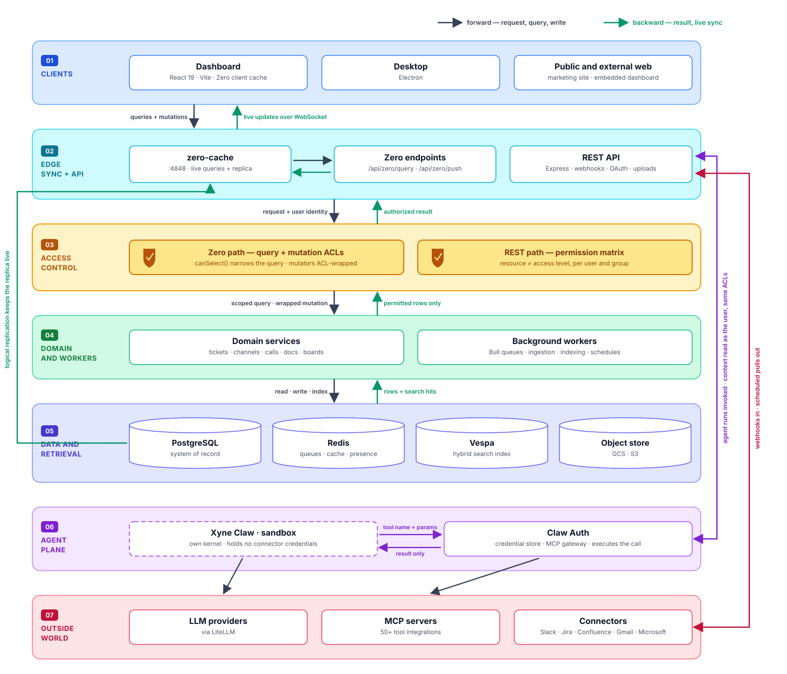
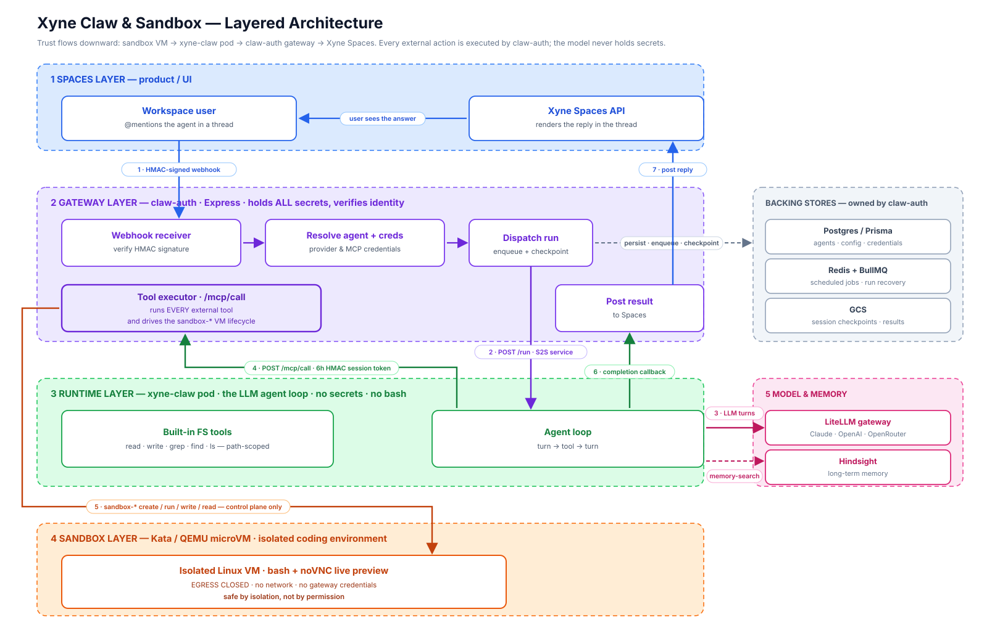

<div align="center">

# Xyne Spaces

**The org OS — your organization's context layer, with collaborative apps built
around it. Real-time, permission-aware and built for agents.**

**At the center: your org's context.** Connectors bring in what your organization
already knows — Slack, Google Workspace, Microsoft 365 and [more](#connectors) —
normalised into a store built for records *and* retrieval, and served back to your
people and your agents through permission-aware org-context APIs, so every caller
gets exactly the slice they're allowed to see.

Around that core sit the [org apps](#org-apps) — Call · Claw · Agentic Search ·
Automations · Customer Support Desk · Chat · Canvas · Tickets — adopted as you
choose, where your team can do the work directly. Work done in them lands straight in the same context store —
with each read and write filtered through the same permission model.

[](LICENSE)
[](https://github.com/juspay/xyne-spaces/actions/workflows/ci.yml)
[](https://www.typescriptlang.org/)
[](CONTRIBUTING.md)

</div>

<details>
<summary><b>📁 Table of Contents</b></summary>

- [Why Xyne Spaces?](#why-xyne-spaces)
- [What can I do with Xyne Spaces?](#what-can-i-do-with-xyne-spaces)
- [Architecture](#architecture)
- [Agents and the sandbox](#agents-and-the-sandbox)
- [Quickstart](#quickstart)
- [Connectors](#connectors)
- [Org apps](#org-apps)
- [MCP tools](#mcp-tools)
- [Demos](#demos)
- [Repository map](#repository-map)
- [Documentation](#documentation)
- [Contributing](#contributing)
- [Feature requests and bugs](#feature-requests-and-bugs)
- [License](#license)

</details>

---

## Why Xyne Spaces?

**Context is the foundation.** Every conversation, decision, ticket, document, and call adds to your organization’s understanding of what it knows, how it works, and where it’s going. Query responses, automation, and agents are only as good as the context they can reach.

That context has to live in one place — normalized, indexed, and served through one interface — rather than pieced together from a dozen tools every time a person or agent needs it.

**The apps build the context as work happens.** They are agent-first and collaboration-first: real-time and shared by default, with people and agents working together in the same threads, tickets, and canvases.

Accessing context — through search or agents — must respect the permissions of the underlying work, so **access control is enforced at the data layer**:

* **Reads respect user permissions.** Queries are scoped to the acting user, returning only the context they’re allowed to access.
* **Writes are enforced centrally.** Mutations go through the same permission layer, so access rules apply consistently across apps and features.
* **Agents inherit the user’s access.** Agents act as the person invoking them, so they can only search, read, and act on context that person can access. There is no privileged bypass.

---

## What can I do with Xyne Spaces?

Xyne Spaces breaks down into four stacks:

- **Context** — the store at the center: connectors bring in what the org knows, and
  permission-aware APIs serve it back.
- **Collaboration** — real-time work with your team: Chat, Call, Canvas.
- **Agentic workflows** — Claw agents, Agentic Search and Automations, all working
  from the same context.
- **Org productivity apps** — Customer Support Desk and Tickets for the day-to-day
  running of the org.

<details>
<summary><b>Bring your org's context into one place</b></summary>
<br>

Sync conversations, tickets, email and calendars from the tools you already use, or bulk
import history from Jira, Confluence and Slack. Everything is normalized, deduplicated,
threaded and indexed for hybrid search.

</details>

<details>
<summary><b>Search across everything you're allowed to see</b></summary>
<br>

Hybrid retrieval over the full corpus — conversations, documents, tickets, call
transcripts — scoped to the person asking. The same index backs both the search box and an
agent's context lookups.

</details>

<details>
<summary><b>Run agents that actually have context</b></summary>
<br>

Agents run inside an isolated sandbox with no credentials of their own, reach your context
through the same permission checks as the UI, and pause for explicit approval before doing
anything that writes. They can search, summarize, triage, draft, review code and act across
connected systems.

</details>

<details>
<summary><b>Work in real time, collaboratively</b></summary>
<br>

Channels, threads, tickets, boards, calls and collaborative canvases. The client keeps a
live local replica rather than polling, so edits appear instantly.

</details>

<details>
<summary><b>Automate the routine work</b></summary>
<br>

Scheduled agent runs, ticket triage and classification, entity extraction, draft replies,
SLA and deadline tracking, recaps and daily briefs — background jobs rather than things
someone has to remember.

</details>

---

## Architecture

<div align="center">
  
</div>

## Agents and the sandbox

Agents here run real code — they read repositories, execute shell commands, call internal
APIs and write files. That is the point, and it is also the risk. So the agent plane is
split across three tiers, and the split *is* the security model:

**the tier that runs untrusted code holds no secrets, and the tier that holds every secret
runs no untrusted code.**

<div align="center">
  
</div>

**The gateway holds everything.** `claw-auth` verifies the HMAC-signed webhook from Spaces,
resolves the agent and its credentials, dispatches the run, and then executes *every*
external tool call itself through `/mcp/call`. It also owns the backing stores — Postgres
for agents and credentials, Redis and BullMQ for scheduled jobs and run recovery, GCS for
session checkpoints.

**The runtime has no secrets and no shell.** The `xyne-claw` pod runs the LLM agent loop and
a set of path-scoped filesystem tools. It cannot reach a connected system directly: it posts
a tool name and parameters back to the gateway with a short-lived HMAC session token and
receives only the result. A compromised run yields no reusable secret, because none was ever
there.

**Bash lives behind a hypervisor.** Anything that needs a real shell runs in a
[Kata Containers](https://katacontainers.io/) QEMU microVM with its own kernel, driven by
the gateway through `sandbox-*` control-plane calls. That VM has **egress closed** — no
network, no gateway credentials — so it is safe by isolation rather than by permission.
Setup lives in `apps/xyne-claw/infra/kata/`.

**Writes need a human.** Read tools run freely. Tools that create a ticket, schedule a call,
edit a canvas or send a message *as you* post an approve/decline card in the thread and wait
for a click. The distinction is identity, not danger: acting as the bot is autonomous,
acting as you needs your consent.

---

## Quickstart

**Prerequisites** — Node.js 22.x, pnpm 10.15.0, and Docker (or OrbStack / Podman) with
Compose. Details in [Prerequisites](docs/setup/prerequisites.md) — or, for a machine
with nothing installed yet, follow [Local Setup](docs/setup/local-setup.md) end to end.

Prefer Nix? A reproducible flake-based dev shell and services are available — see
[Nix](docs/setup/nix.md).

```bash
git clone https://github.com/juspay/xyne-spaces.git
cd xyne-spaces
pnpm run up
```

<details>
<summary>What <code>pnpm run up</code> does</summary>
<br>

Each phase runs serially and stops at the first failure. Every phase is idempotent, so
re-running it on an existing checkout is safe — and you can run any phase on its own.

| Phase | What it does |
| --- | --- |
| `pnpm run env:setup` | Copies each app's `.env.example` into place — never overwrites an existing file |
| `pnpm run setup` | Installs workspace dependencies and builds the shared packages |
| `pnpm run secrets` | Generates the local secrets that ship as `set-me` placeholders |
| `pnpm run services` | Asks which features you need, checks ports, starts infrastructure containers, runs migrations, seeds the databases |
| `pnpm run dev` | Asks which apps to run, then opens them in a multi-pane process TUI (one pane per app, restart any one with `r`) |

The pickers remember previous answers, and both stages check that the ports they
need are free before starting — naming the process that holds a busy one. Scripted
runs skip every prompt (`pnpm run bootstrap:raw`, `XYNE_DEV_APPS=all pnpm run dev`).

The bootstrap phases and `validate` use **Xyne Doctor**. In an interactive
terminal, a nonzero exit can package a redacted local failure report and hand it to Claude Code or
Codex without leaving the terminal. Plain and automated runs keep normal output without persisting
a report. See [Xyne Doctor](docs/setup/xyne-doctor.md) for safety behavior and a demo.

</details>

Once it finishes:

| Service | URL |
| --- | --- |
| Dashboard | http://localhost:5173 |
| Backend API | http://localhost:3001 |
| API reference | [API_DOCUMENTATION.md](API_DOCUMENTATION.md) |
| Xyne Claw | http://localhost:3002 |
| Claw Auth | http://localhost:3003 |

Sign in locally with `admin@xyne.ai` / `xynelocal@123`.

Stuck? → [Troubleshooting](docs/setup/troubleshooting.md). Configuring model providers?
→ [AI providers](docs/setup/ai-providers.md).

---

## Connectors

Context arrives two ways. **Live sync** is continuous — webhooks in, scheduled pulls out.
**Migration** is a one-time bulk import of history. Both end in the same place: normalized
records in PostgreSQL, indexed into Vespa, behind the same ACLs as everything else.

| Connector | Type | Brings in |
| --- | --- | --- |
| **Slack** | Live sync + migration | Channels, threads, messages; ticket intake from Slack |
| **Gmail / Google Workspace** | Live sync | Mail, attachments, calendar |
| **Microsoft 365** | Live sync | Mail and calendar |
| **Jira** | Migration | Projects, issues and history |
| **Confluence** | Migration | Spaces, page trees and attachments |

The pipeline is platform-agnostic: each connector is an adapter — resolve, authenticate,
transform, sync — and everything after it is shared. Adding a platform means writing an
adapter, not touching the pipeline. Credentials are stored encrypted and decrypted only at
the moment of use.

→ Adapter contract: [`apps/backend/src/integrations/README.md`](apps/backend/src/integrations/README.md)

---

## Org apps

Eight apps, adopted independently. All of them read and write through the same context
store and permission model.

| App | What it does |
| --- | --- |
| **Call** | Team calls with recordings; transcripts are indexed into the context store. |
| **Claw** | Sandboxed agents that read repositories, run code and call tools on connected systems; actions taken as you require approval. |
| **Agentic Search** | Search across conversations, documents, tickets and call transcripts, scoped to the person asking; the same retrieval backs agents' context lookups. |
| **Automations** | Scheduled agent runs and background jobs: ticket triage and classification, entity extraction, draft replies, SLA tracking, recaps. |
| **Customer Support Desk** | Ticket intake, queues and triage. |
| **Chat** | Channels, threads and DMs, live-synced. |
| **Canvas** | Collaborative documents, drafted and reviewed together in real time. |
| **Tickets** | Tickets and boards for planning and tracking work. |

---

## MCP tools

Connectors bring context **in**. MCP tools let an agent **act on** an external system —
different system, different code path, configured per user rather than per workspace.

Claw Auth brokers **50+ MCP integrations**. A representative slice:

| Category | Examples |
| --- | --- |
| Code and delivery | GitHub, Bitbucket, Sentry, Grafana, Honeycomb, Kibana |
| Work tracking | Asana, Notion, Calendly, Docusign |
| Data | BigQuery, ClickHouse, Databricks, MongoDB, Neo4j |
| Product and growth | Amplitude, Mixpanel, Customer.io, HubSpot, Salesforce, Intercom |
| Design and docs | Figma, Miro, Excalidraw, Webflow |
| Xyne first-party | Spaces context search, ticket and canvas tools, knowledge base, dashboard |

A connector only appears for a user once they have connected it, so an agent's available
tools are a function of that user's own integrations — and tool sets are scoped per agent
rather than handing every run the full catalogue.

---

## Demos

> 📹 Walkthroughs are being recorded. Links land here as they are published.

| Demo | What it covers | Link |
| --- | --- | --- |
| Getting started | Clone to running locally in one command | _coming soon_ |
| Spaces tour | Channels, threads, tickets, boards and canvases | _coming soon_ |
| Permission-aware context | The same search, two users, two different result sets | _coming soon_ |
| Agents in a thread | Asking an agent, citations, approving a write action | _coming soon_ |
| Connecting a source | Connecting Slack and watching context arrive | _coming soon_ |
| Migrating from Jira / Confluence | Preview, mapping and import | _coming soon_ |

---

## Repository map

```
xyne-spaces/
├── apps/
│   ├── backend/            REST API, Zero sync server, workers, integrations
│   ├── dashboard/          Web client — React 19 + Vite + Zero
│   ├── dashboard-external/ Externally embeddable dashboard
│   ├── electron/           Desktop wrapper
│   ├── public-web/         Public marketing site
│   ├── site/               Documentation site
│   ├── xyne-claw/          Agent runtime — the sandbox
│   └── xyne-claw-auth/     Identity, credential store, MCP gateway
├── packages/
│   ├── shared/             Zero schema, query ACLs, shared types
│   ├── framework/          Agentic framework library
│   ├── icons/              Icon set
│   └── xyne-claw-mcp/      MCP server + plugin for Xyne Claw agents
├── vespa-core/             Search schemas and deployment
├── docker/                 Container configuration
├── docs/                   Setup documentation
├── scripts/                Bootstrap, seeding and validation scripts
└── tools/                  E2E automation and analysis tooling
```

| Component | Stack |
| --- | --- |
| Backend | Node 22, TypeScript, Express, Prisma, PostgreSQL, Redis, Bull |
| Sync | Zero (Rocicorp), ACL-enforced queries and mutators |
| Dashboard | React 19, Vite, Tailwind, Radix UI, XState, TipTap |
| Search | Vespa |
| Agents | Xyne Claw + Claw Auth, MCP tooling, LiteLLM for model access |
| Isolation | Kata Containers with QEMU microVMs, egress closed |

---

## Documentation

| Guide | |
| --- | --- |
| [Local setup](docs/setup/local-setup.md) | From a blank machine to a running environment |
| [Prerequisites](docs/setup/prerequisites.md) | Versions and tooling you need first |
| [Local development](docs/setup/local-development.md) | Getting a working environment |
| [Nix](docs/setup/nix.md) | Reproducible dev shell and services via the Nix flake |
| [Services](docs/setup/services.md) | What the infrastructure containers do |
| [AI providers](docs/setup/ai-providers.md) | Configuring model access |
| [Troubleshooting](docs/setup/troubleshooting.md) | When setup goes wrong |
| [API reference](API_DOCUMENTATION.md) | REST API documentation |
| [MCP Gateway integration](apps/xyne-claw-auth/docs/mcp-gateway-integration.md) | Claw Auth MCP gateway integration guide |

---

## Contributing

Read [CONTRIBUTING.md](CONTRIBUTING.md) first — it covers what the tooling enforces, so a
first pull request does not bounce on something mechanical. In short: branches are `fix/*`
or `feature/*`, commits are `<type>: <TICKET-ID> <subject>`, and dependencies are added
with a `--filter`.

For anything larger than a small fix, open an issue first so the approach can be agreed
before it is written. Participation is governed by our
[Code of Conduct](CODE_OF_CONDUCT.md).

## Feature requests and bugs

- **Bug** — [open a bug report](https://github.com/juspay/xyne-spaces/issues/new?template=bug_report.yml)
  with what you ran, what happened, and the output.
- **Feature** — [open a feature request](https://github.com/juspay/xyne-spaces/issues/new?template=feature_request.yml)
  describing the problem before the solution.

## License

Licensed under the [Apache License 2.0](LICENSE).
