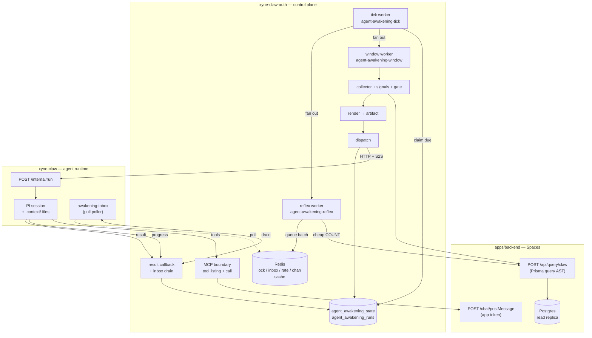
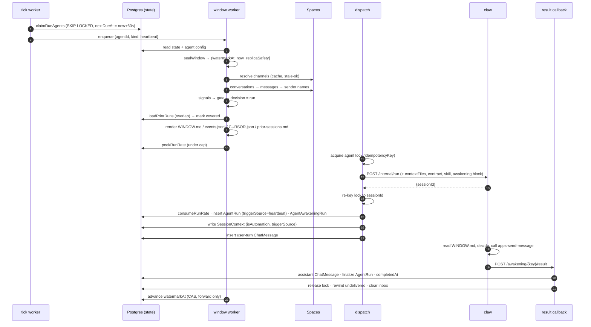
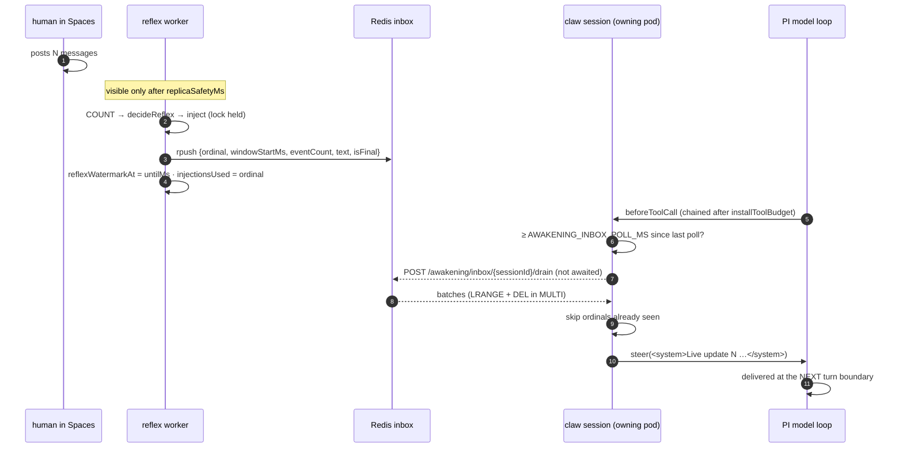
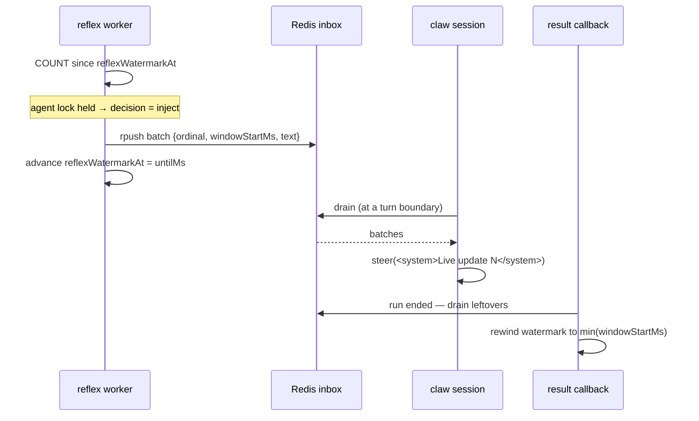

# Awakened Agents — Architecture & Operations

**Status:** Landed · heartbeat + reflex + live injection all verified end-to-end against a live workspace
**Services touched:** `xyne-claw-auth` (control plane), `xyne-claw` (agent runtime), `apps/backend` (Spaces)
**Last updated:** 2026-08

---

## 0. What this is

Every other way an agent runs in this platform starts with a human: a mention in
Spaces, a chat message, an API call, a scheduled job somebody configured for a
specific purpose. **Awakening is the path where nobody starts it.** The agent
wakes on its own, is handed everything that happened in the channels it watches
since it last looked, decides whether any of it is worth acting on, and acts —
posting into threads with its own bot identity.

The metaphor the feature was designed around, and the one the code is named for:
a **heartbeat** circulates **blood** (events) from the **lungs** (people talking
in channels) to the **brain** (the agent). A **reflex** is the faster, shallower
loop that fires when enough happens at once to be worth reacting to *now*.

Two wake kinds, both optional per agent:

| Kind | Trigger | Cost per check | Typical use |
|---|---|---|---|
| **Heartbeat** | wall clock (`periodMs`, default 30m) | full window collect | periodic situational awareness, catching what threads got dropped |
| **Reflex** | event volume (`reflex.threshold` events since its watermark) | one `COUNT` query | reacting fast when a burst of activity happens |

An agent can run `heartbeat`, `reflex`, or `both`. With `both`, the heartbeat
also reads what the reflexes already did, so it doesn't answer a question a
reflex answered twenty minutes ago (§9).

### Design constraints this was built under

1. **Critical path — must never break.** Every stage fails closed or fails
   open deliberately, never by accident. A broken window must not take down an
   agent; a broken agent must not take down the tick loop.
2. **Multi-pod is the production reality.** claw-auth, claw and Spaces all run
   horizontally scaled. Nothing may assume a single instance.
3. **Configurable, with real bounds.** Every number is an admin knob with a
   clamped range and a safe default.
4. **Extensible backbone.** Adding a wake kind, a gate rule or an artifact file
   must not require touching the exactly-once machinery.

---

## 1. Vocabulary

| Term | Meaning |
|---|---|
| **Window** | A half-open time range `(watermarkAt, now − replicaSafetyMs]` and everything that happened in the watched channels inside it. |
| **Watermark** | Exclusive upper bound of the last *sealed* window. Two separate ones per agent: `watermarkAt` (heartbeat) and `reflexWatermarkAt`. |
| **Seal** | Closing a window at a fixed instant. Windows never close at `now()` — see §5.1. |
| **Gate** | The ordered rule table that decides whether a collected window is worth a run at all. |
| **Artifact** | The set of files written into the run's `.context/heartbeat/` directory: `WINDOW.md`, `events.jsonl`, `CURSOR.json`, `prior-sessions.md`. |
| **Contract** | The `additionalInstructions` block every awakened run receives, telling it the one thing its priors get wrong: its final answer is not delivered to anyone. |
| **Injection** | New events handed to a run that is already in flight, so it adapts mid-task. |
| **Agent lock** | The Redis key that guarantees one awakened run per agent at a time. |

---

## 2. Architecture at a glance



**Ownership:** claw-auth owns *everything about deciding to wake* — scheduling,
collection, gating, artifact rendering, safety policy, bookkeeping. claw owns
*running the agent*. claw knows almost nothing about awakening: it receives an
`awakening` block, writes the context files, and installs one extra poller.

---

## 3. Data model

Two tables. Both live in claw-auth's Postgres. All status/kind fields are plain
`String` — Postgres enums are frozen repo-wide by
`scripts/validate-no-new-enums.sh`.

### 3.1 `agent_awakening_state` — one row per agent

| Column | Type | Meaning |
|---|---|---|
| `agentId` | String `@unique` | The agent this state belongs to |
| `orgId` | String | Tenant |
| `enabled` | Boolean = false | Master switch; mirrors `config.awakening.enabled` |
| `nextDueAt` | DateTime | Heartbeat due time. What the tick claim scans. |
| `lastTickAt` | DateTime? | Last time this row was claimed |
| `watermarkAt` | DateTime | Exclusive upper bound of the last sealed **heartbeat** window |
| `watermarkMessageId` | String? | Tie-breaker for events sharing `watermarkAt` to the millisecond |
| `consecutiveFailures` | Int = 0 | Backoff state — this *is* the circuit breaker, no separate machine |
| `consecutiveSkips` | Int = 0 | Feeds the anti-starvation rule (`forceRunEveryNSkips`) |
| `lastError` | Text? | Last failure reason, surfaced in the admin status endpoint |
| `reflexNextCheckAt` | DateTime? | Reflex due time — separate, much faster cadence |
| `reflexWatermarkAt` | DateTime? | Reflex's **own** watermark |
| `reflexLastRunAt` | DateTime? | Enforces `reflex.minIntervalMs` |

Indexes: `(enabled, nextDueAt)` and `(enabled, reflexNextCheckAt)` — the two hot
claim scans — plus `(orgId)`.

> **Why two watermarks.** The two wake kinds are *meant* to see the same events
> for different reasons: the reflex reacts fast and shallow, the heartbeat later
> synthesises the whole period **and reads what the reflexes already did**.
> Sharing one watermark would let a reflex consume events the heartbeat then
> never sees.

### 3.2 `agent_awakening_runs` — one row per wake *attempt*

Written whether or not a run was dispatched. Serves three jobs at once: the
idempotency guard, the admin health view, and the §9 overlap lookup.

| Column | Type | Meaning |
|---|---|---|
| `kind` | String | `"heartbeat"` \| `"reflex"` |
| `windowStartMs`, `windowEndMs` | BigInt | Window bounds as epoch millis — BigInt so a JS `Date` round-trip cannot lose precision on the overlap query |
| `outcome` | String | `"ran"` \| `"skipped"` \| `"failed"` \| `"shadow"` |
| `skipReason` | String? | Which gate rule fired, when skipped |
| `eventCount` | Int | Events in the window |
| `signals` | Json? | Denormalized signal counts the gate decided on — answers "why did/didn't it wake" without re-deriving the window |
| `sessionId` | String? | The claw session, once dispatched |
| `idempotencyKey` | String `@unique` | The duplicate-dispatch guard |
| `injectionsUsed` | Int = 0 | Live-injection batches queued for this run |
| `startedAt`, `completedAt` | DateTime | |

Indexes: `(agentId, windowStartMs)` for the overlap lookup, `(orgId, startedAt)`
for the admin list.

### 3.3 Redis keys

| Key | Shape | TTL | Purpose |
|---|---|---|---|
| `claw:awk:lock:{agentId}` | JSON `{sessionId, kind, acquiredAtMs}` | run-scoped | One awakened run per agent. `SET NX PX`; released and refreshed by Lua CAS on `sessionId`. |
| `claw:awk:inbox:{sessionId}` | Redis list of batch JSON | 3600s | Queued live-injection batches, max 20 |
| `claw:awk:inject:{sessionId}` | JSON `{used, lastAtMs}` | 3600s | Injection counters for the cap and min-interval |
| `claw:awk:rate:{agentId}:{bucket}` | counter | 7200s | Runs-per-hour limiter; 2h TTL so the previous bucket survives long enough to diagnose |
| `claw:awk:chan:{agentId}:{rulesHash}` | resolved channel list | `checkIntervalMs`-scoped | Channel resolution cache, keyed by a hash of the rules so a config edit invalidates it |

---

## 4. Configuration reference

All of it lives under `agent.config.awakening`. Two layers validate it:

- **`validateAwakeningConfig`** (`src/lib/agent-config-validation.ts`) runs on
  the save path and **rejects with 400** — wrong types, unknown enum values,
  out-of-range integers, over-long instructions.
- **`resolveAwakeningConfig`** (`src/awakening/config.ts`) runs on every read and
  **never throws**. It clamps, coerces and falls back to defaults. A stored
  config that somehow went bad must not be able to disable a working agent or
  crash a worker.

### 4.1 Top level

| Key | Type | Default | Notes |
|---|---|---|---|
| `enabled` | boolean | `false` | Master switch |
| `kind` | `heartbeat` \| `reflex` \| `both` | `heartbeat` | |
| `periodMs` | int | `1_800_000` (30m) | Heartbeat period. Range 5m – 24h |
| `writePolicy` | `observe` \| `reply` \| `act` | `reply` | Enforced as tool denials, §7.1 |
| `shadow` | boolean | `true` | Overrides `writePolicy` down to `observe` |
| `instructions` | string | `""` | Owner-written guidance, ≤ 10000 chars. §7.3 |
| `workspaceId` | string? | — | Rarely needed. The workspace is resolved from the agent's own bot user; this only pins it when that user cannot be read, and it must match the bot's workspace |

### 4.2 Channels

| Key | Type | Default | Notes |
|---|---|---|---|
| `channels.include` | string[] | `[]` | Channel ids |
| `channels.includePattern` | string[] | `[]` | Regexes over channel **name**. Max 10 patterns, 200 chars each |
| `channels.exclude` | string[] | `[]` | Ids; exclusion always wins |
| `channels.excludePattern` | string[] | `[]` | Regexes; exclusion always wins |
| `channels.maxChannels` | int | `25` | Range 1 – 100. Truncation is surfaced to the agent in the artifact |

> **Rules can only narrow, never widen.** The candidate set is the channels the
> agent's bot is *actually a member of*. A catch-all `.*` resolves to exactly
> what the bot can already read, never to a channel nobody added it to. Regex
> matching runs under a 50 ms wall-clock budget so a pathological pattern cannot
> stall the tick, and an uncompilable pattern is dropped with a warning rather
> than failing the run.

### 4.3 Gate and limits

| Key | Type | Default | Range | Notes |
|---|---|---|---|---|
| `gate.minHumanEvents` | int | `1` | 0 – 1000 | Below this, skip |
| `gate.forceRunEveryNSkips` | int | `0` | 0 – 100 | Anti-starvation; 0 disables |
| `limits.maxEvents` | int | `1500` | 10 – 5000 | Window event cap |
| `limits.maxActiveThreads` | int | `400` | 5 – 1000 | Thread prefilter cap |
| `limits.maxRunsPerHour` | int | `4` | 1 – 60 | Hard ceiling on dispatches |

### 4.4 Reflex

| Key | Type | Default | Range | Notes |
|---|---|---|---|---|
| `reflex.checkIntervalMs` | int | `60_000` | 15s – 1h | How often the cheap COUNT runs. **Effective value is `max(this, AWAKENING_TICK_MS)`** — see §14 defect 16 |
| `reflex.threshold` | int | `25` | 1 – 1000 | Events since the reflex watermark that trigger a wake |
| `reflex.minIntervalMs` | int | `300_000` | 0 – 24h | Floor between two reflex runs |
| `reflex.injectEnabled` | boolean | `true` | | Live injection master switch |
| `reflex.injectThreshold` | int | `10` | 1 – 1000 | New events needed to interrupt a running agent |
| `reflex.maxInjectionsPerSession` | int | `3` | 0 – 20 | A run still has to converge |
| `reflex.injectMinIntervalMs` | int | `60_000` | 0 – 1h | Floor between two injections into one session |

### 4.5 Cursor

| Key | Type | Default | Range | Notes |
|---|---|---|---|---|
| `cursor.replicaSafetyMs` | int | `30_000` | 0 – 300s | How far behind `now` a window closes. **This is the floor on end-to-end latency** — see §8.3 |
| `cursor.overlapMs` | int | `120_000` | 0 – 15m | Re-scan band below the watermark, de-duplicated against a seen-set |
| `cursor.maxCatchupWindows` | int | `4` | 1 – 50 | Backlog cap before the gap guard jumps the watermark forward |

### 4.6 Where an admin sets this

Agent detail → **Awakening** tab (`AwakeningTab.tsx`). Sections:
**Safety** (shadow, write policy, max runs/hour) · **Run instructions**
(free-text guidance) · **When it wakes** (kind, period, reflex knobs) ·
**Channels** (includes, patterns, excludes, cap) · **Gate** (min human events,
anti-starvation) · **Live updates** (injection knobs, replica safety margin,
plus a computed line telling the admin the actual injection latency their
settings produce).

The client mirrors `AWAKENING_BOUNDS` in `frontend/src/v3/lib/awakeningBounds.ts`
purely to shape the editor. The server re-clamps and re-validates everything it
is sent, so the UI can never widen a real bound.

---

## 5. The pipeline, stage by stage

### 5.0 Tick and claim

One repeatable BullMQ job for the whole fleet — `agent-awakening-tick`, every
`AWAKENING_TICK_MS` (default 60s), worker concurrency strictly 1.

> **Deliberately not one repeatable job per agent.** A per-agent repeatable set
> drifts: a rename or a missed cleanup silently stops an agent forever. With a
> single scheduler, every pod boot converges on the same one job.

Each tick claims due rows with `FOR UPDATE SKIP LOCKED` and immediately writes a
provisional `nextDueAt = now + 60s`:

```sql
UPDATE "agent_awakening_state" AS s
   SET "nextDueAt" = $provisional, "lastTickAt" = NOW()
 WHERE s."id" IN (
   SELECT "id" FROM "agent_awakening_state"
    WHERE "enabled" = TRUE AND "nextDueAt" <= NOW()
    ORDER BY "nextDueAt" ASC
    LIMIT $limit
    FOR UPDATE SKIP LOCKED
 )
RETURNING ...
```

`claimDueReflexChecks` is the same shape against `reflexNextCheckAt`. **This is
the multi-pod safety story at the scheduling layer:** N pods can run the same
tick concurrently and each agent is claimed by exactly one of them. Verified
under test with 25 agents × 6 simulated pods — every agent claimed exactly once.

> **Ordering constraint:** `fanOutReflexChecks` must run **before** the
> heartbeat early-return in `processTick`. It didn't originally, and the effect
> was that reflexes only fired on ticks where a heartbeat also happened to be
> due.

Claimed agents are fanned out onto `agent-awakening-window` (concurrency
`AWAKENING_WINDOW_CONCURRENCY`, default 5) and `agent-awakening-reflex`
(`AWAKENING_REFLEX_CONCURRENCY`, default 10).

> **The tick is the floor on every cadence.** `reflex.checkIntervalMs` sets
> `reflexNextCheckAt`, but the row is only *claimed* when the tick runs. With
> the default `AWAKENING_TICK_MS=60_000`, a configured 15s reflex interval still
> checks once a minute. The scheduler is registered with `upsertJobScheduler`
> under a stable id, so changing the interval and restarting cleanly replaces
> the schedule.

### 5.1 Sealing the window

`sealWindow(watermarkAt, config, now)` → `{ startMs, endMs, gap }`.

Three invariants, each guarding a specific failure:

1. **A window never closes at `now()`.** Spaces reads hit a **read replica**, so
   rows written moments ago may not have replicated. Sealing at
   `now − replicaSafetyMs` and stepping the watermark to that same instant is
   what stops the cursor from stepping over unreplicated rows forever.
2. **The watermark never rewinds.** It advances by compare-and-set that only
   moves forward, so two pods racing on one agent can at worst repeat work —
   never un-see events.
3. **A failed window does not advance it.** Skips do (the window was genuinely
   empty or boring; re-reading produces the same skip). Failures don't, so the
   next wake retries the same range.

**Gap guard.** If `endMs − startMs > periodMs × maxCatchupWindows` (an agent
disabled for a week, a fleet down overnight), the watermark jumps forward and
the skipped span is recorded in the window header where the agent can see it.
Replaying days of backlog into one window would blow the event cap and hand the
model a useless artifact.

### 5.2 Resolving channels

`resolveAwakeningChannels(agentId, rules, identity, ttlMs)`:

1. Read the channels the bot is a member of (Spaces `channelParticipant` + `channel`).
2. Apply include/exclude ids and patterns — pure, in `channel-rules.ts`, split
   out precisely so the rule semantics test without Redis, a DB or an env file.
3. Cap at `maxChannels`, recording truncation.
4. Cache in Redis under a key that includes `hashChannelRules(rules)`.

**Stale-ok on failure:** if the live lookup fails but a cached list exists, the
cached one is used. A Spaces blip degrades freshness, it does not stop the agent.

### 5.3 Collecting

`collectWindow(channels, sinceMs, untilMs, identity, config)`. **Two stages,
because `Message` has no `channelId` column:**

1. `conversation` where `channelId IN (...)` and `lastActivityAt >= since`,
   ordered by `lastActivityAt desc`, capped at `maxActiveThreads`.
2. `message` where `conversationId IN (...)`, `createdAt` in the window,
   `isDeleted = false` — keyset-paged.
3. A **third** query resolves sender display names, because the Spaces query AST
   supports neither `select` nor `include` (both are silently dropped by
   `QueryASTSchema`), so a relation select is a no-op and every row comes back
   whole. Without this the artifact is full of raw cuids and the agent cannot
   address anyone by name.

**Where this reads from:** `boundedInteract` → `interact` → `POST /api/query/claw`
→ `readReplicaDb[model].findMany(...)` — **Postgres read replica, not Vespa.**
This is deliberate and differs from the digital-twin memory path, which is
Vespa-first. Awakening needs an exhaustive, ordered, keyset-paged scan of a
channel × time window; Vespa's HTTP surface caps at limit 200 / offset 1000, has
only day-granular date filters, and is eventually consistent behind a Bull
queue. Postgres gives exact window boundaries and no index lag.

**`boundedInteract` throws `UnboundedQueryError`** on any `findMany` without an
explicit `take`. `QueryASTSchema` makes `take` optional, so `MAX_TAKE` binds only
when supplied — an omitted `take` is an unbounded scan of Spaces' hot tables. A
background loop must not be able to issue one.

**Text extraction.** Spaces stores what the rich-text editor produced, so a real
message is `<p class="m-0 leading-6">hey</p>`. `messageToText` converts to
readable text before any signal runs, preserving mention identity as
`@Name[userId]` — the same shorthand the send tool accepts, so the agent can copy
a mention straight from the window into a reply. `mentionsMe` is still evaluated
against the **raw** HTML, because that is where a mention's user id lives as a
span attribute.

`markUnanswered` then flags, per thread, the last event when it is a human
message nobody replied to.

### 5.4 Signals

Twelve counts, computed purely from the events (`signals.ts`):

`eventCount` · `humanEventCount` · `botEventCount` · `selfEventCount` ·
`distinctSenders` · `distinctThreads` · `newThreads` · `unansweredThreads` ·
`mentionsOfMe` · `questions` · `actionSignals` · `channelsWithActivity`

### 5.5 The gate

An **ordered rule table**. First rule to return `run` or `skip` decides;
`continue` falls through. `empty_window` is checked before the table.

| # | Rule | Condition | Outcome | Rationale |
|---|---|---|---|---|
| — | `empty_window` | `eventCount === 0` | **skip** | Nothing happened |
| 1 | `direct_mention` | `mentionsOfMe > 0` | **run** | Somebody is actively waiting on it |
| 2 | `escalation_signal` | `actionSignals > 0` | **run** | One "P1, who can look at this" outranks fifty chatty messages |
| 3 | `no_human_activity` | `humanEventCount === 0` | **skip** | Only its own posts and other bots — this is how an agent ends up talking to itself |
| 4 | `below_min_human_events` | `humanEventCount < gate.minHumanEvents` | **skip** | |
| 5 | `unanswered_thread` | `unansweredThreads > 0` | **run** | Humans talking, last word unanswered |
| 6 | `open_question` | `questions > 0` | **run** | |
| 7 | `no_actionable_signal` | always | **skip** | Chatter with nothing hanging — read it next window as history |

**Anti-starvation override:** any `skip` becomes a `run` (rule
`forced_after_skips`) once `consecutiveSkips >= gate.forceRunEveryNSkips`, when
that is non-zero. It bounds how stale an agent's situational awareness can get.

### 5.6 Rendering the artifact

The window becomes files written into the session's `.context/heartbeat/`
directory. The design principle: **an overview the agent reads top-to-bottom,
pointing at detail it can grep.** Nothing forces the whole window through the
context window.

| File | Contents |
|---|---|
| `WINDOW.md` | The entry point. Front-matter (kind, bounds, event count, truncation, gap, writePolicy, shadow), then §1 Metrics, §2 Channels, §3 What already happened, §4 Outline of every event grouped by thread, §5 Files + grep recipes |
| `events.jsonl` | One JSON object per line, chronological, **fixed key order** so greps are stable |
| `CURSOR.json` | Exact window bounds and coverage proof |
| `prior-sessions.md` | What earlier runs overlapping this window already did (§9) |

`events.jsonl` fields, in emission order:

```
L, kind, at, id, ch, chName, cv, cvTitle, sender, senderId,
isHuman, isMe, root, mentionsMe, unanswered, covered, coveredBy,
question, actionSignals, edited, chars, text
```

`L` is the line number, assigned by an explicit `assignLineNumbers()` pass —
originally `renderWindowMarkdown` depended on `renderEventsJsonl` having
assigned it first, a hidden ordering dependency that broke when the two were
called out of order.

Every thread heading in the outline prints the ids needed to answer it:

```
### awkfix-eng-alerts / `awkfix_cv_5` — "quick question about retries" (4 events, L26–L29)
reply here → `channelId: "awkfix_ch_alerts", conversationId: "awkfix_cv_5"`
```

Line ranges use `describeLines()`, which renders non-contiguous sets correctly —
lines 1, 2 and 10 read as `L1–L2, L10`, not the misleading `L1–L10`.

### 5.7 Dispatch

`dispatchAwakening(window, agent, identity, idempotencyKey)` mirrors
`queue/scheduled-jobs-worker.ts`, the proven headless dispatch path.

**Pre-flight is fail-closed on identity.** An unattended run acts as the agent's
own app identity or not at all — `AwakeningIdentityError` disables the agent
rather than falling back to a user token, which would mean a background loop
acting with a human's credentials.

Ordering, and it matters:

1. Acquire the agent lock **before** dispatch, keyed on the idempotency key
   (otherwise a second pod could dispatch in the gap).
2. `ensureUserExists(botId, "awakening", agent.orgId)` — org is derived from the
   run's user, never from the request (`x-org-id` is stripped inbound).
3. POST `/claw/api/v1/internal/run`.
4. Re-key the lock to the real `sessionId` so the result callback and the
   injection path can both find it.
5. Insert the `AgentRun` row ourselves (`__persistedByCaller: true`) so it
   carries `triggerSource: "heartbeat" | "reflex"` — without it the pod inserts
   its own row tagged `"spaces"` and the two race on the `sessionId` unique
   constraint.
6. Write the `SessionContext` (§6.2).
7. Create the user-turn `ChatMessage` so the conversation opens in the chat UI.

---

### 5.8 End-to-end sequences

**A heartbeat wake that runs.**



**A reflex wake.** Same tail, different head: the tick claims
`reflexNextCheckAt`, the worker runs one `COUNT` since `reflexWatermarkAt`, and
only escalates to a full `collectWindow` once `decideReflex` returns `fire` or
`inject`. Below threshold it does nothing at all — that is the whole point of
the cheap check.

`decideReflex` is pure, and has six terminal states. This is the table to reach
for when asking *"why did my mid-run events not arrive?"*:

| Agent busy? | Condition | Decision | Meaning |
|---|---|---|---|
| no | `count < reflex.threshold` | `wait` | Not enough has happened yet |
| no | `sinceLastRunMs < reflex.minIntervalMs` | `hold: min_interval` | Fired too recently |
| no | otherwise | **`fire`** | Dispatch a new reflex run |
| yes | `!reflex.injectEnabled` | `hold: injection_disabled` | Injection turned off for this agent |
| yes | `count < reflex.injectThreshold` | `wait` | Accumulating — logged, because this is the common confusion |
| yes | `injectionsUsed >= maxInjectionsPerSession` | `hold: injection_cap_reached` | The run still has to converge |
| yes | `sinceLastInjectionMs < injectMinIntervalMs` | `hold: injection_min_interval` | Too soon after the last update |
| yes | otherwise | **`inject`** | Queue a batch for the running session |

Remember that "busy" means the **agent lock** is held, and that only a `fire`
writes an `agent_awakening_runs` row (§14 defect 12) — so for every other state
the log line is the only evidence.

**A mid-run injection, end to end.**



The poll is deliberately **not awaited** inside `beforeToolCall` — a tool call
must not wait on the inbox. The practical consequence: a batch drained during
tool call *N* is usually consumed at the boundary after the drain resolves,
which may be a later boundary than the one immediately following that call.

**A window that fails.** The worker throws (Spaces unreachable, dispatch 500).
`consecutiveFailures` increments and pushes `nextDueAt` out exponentially; the
**watermark does not move**, so the next successful wake re-reads the same
range. The agent lock is released in the `catch`. `outcome = "failed"` is
recorded. The first success resets the counter.

**A window that skips.** The gate returns `skip`. `consecutiveSkips` increments,
the watermark **does** advance (re-reading would produce the same skip), and the
run row records `outcome = "skipped"` with the rule id in `skipReason`. Once
`consecutiveSkips` reaches `forceRunEveryNSkips`, the next skip is overridden to
a run.

---

## 6. Service contracts

### 6.1 claw-auth → claw: `POST /claw/api/v1/internal/run`

Header `x-s2s-key`. The awakening-specific parts of the body:

| Field | Value |
|---|---|
| `eventType` | `"awakening"` |
| `detached` | `true` |
| `conversationId` | `awaken_{agentId}_{windowEndMs}` |
| `callbackUrl` | `{internalUrl}/claw/api/v1/awakening/{idempotencyKey}/result` |
| `progressUrl` | `{internalUrl}/claw/api/v1/webhook/progress` |
| `idempotencyKey` | `awk_{kind}_{agentId}_{windowStartMs}` |
| `contextFiles` | The rendered artifact — claw writes them into `.context/` before the agent starts |
| `additionalInstructions` | The operating contract (§7.2) |
| `skills` | `[xyne-heartbeat]` or `[xyne-reflex]` |
| `agentConfig` | Stored config **plus** the per-run `apps-send-message` grant |
| `__persistedByCaller` | `true` |
| `awakening` | See below |

```jsonc
"awakening": {
  "kind": "heartbeat" | "reflex",
  "writePolicy": "observe" | "reply" | "act",
  "shadow": false,
  "windowStartMs": 1787648780399,
  "windowEndMs": 1787650580399,
  "entryPath": ".context/heartbeat/WINDOW.md",
  // Reflex only: a heartbeat is a deliberate pass over a SEALED window, and
  // mutating that window mid-run would make its own artifact a lie.
  "injectEnabled": true
}
```

The `awakening` block is only honoured from an **S2S caller**. A browser cannot
self-declare a run unattended and thereby claim the bot-identity send tool.

### 6.2 The SessionContext

Written by claw-auth **before** forwarding to claw, not after. This is
load-bearing and was a real bug: claw lists its MCP tools within milliseconds of
the POST returning, and that listing reads this context to decide app-mode vs
user-mode. Writing it after the dispatch resolved was a race the run usually
lost, and the agent then came up with no way to speak at all.

| Field | Value | Read by |
|---|---|---|
| `triggerSource` | `"heartbeat"` \| `"reflex"` | `routes/mcp.ts` (tool grant), `agent-chat.ts` (admin visibility), `webhook.ts` (live events) |
| `isAutomation` | `true` | `routes/mcp.ts` — selects **app-mode** Spaces |
| `suppressThreadReply` | `true` | The final answer is an operator log line, not a channel message |
| `senderId` / `mentionedUserId` | the bot's `spacesAppUserId` | Spaces tools |
| `channelId` | `""` | No single channel — the agent picks per tool call |
| `appToken` | decrypted app token | Spaces app calls |

### 6.3 claw → claw-auth

| Route | Auth | Purpose |
|---|---|---|
| `POST /awakening/:idempotencyKey/result` | `requireStrictS2S` | Terminal callback. Idempotent by construction — writes `completedAt` on a row keyed by the same idempotency key the dispatch used. |
| `POST /awakening/inbox/:sessionId/drain` | `requireStrictS2S` | Destructive drain of queued injection batches |
| `GET /awakening/:agentId/status` | `requireAuth` + `requireNoAccessToken` + `requireClawAdmin` | Admin health: state row + last 20 runs |

The result callback **acks first, reconciles after** — claw must never block on
claw-auth's bookkeeping, and every write after the ack is best-effort and
independently retryable. It persists the assistant turn, finalizes the
`AgentRun` (status, result, `toolsUsed`, `toolInvocations`, token usage,
provider/model, latency), releases the agent lock, rewinds the watermark over any
undelivered injection batches (§8.2), and clears the inbox.

> The result route is deliberately **its own route**, not `/webhook/result`.
> That handler is a long shared hot path carrying every user-facing delivery
> concern — thread replies, cards, follow-ups, twin routing. An unattended run
> needs none of it. Keeping them separate means awakening can never regress
> human chat, and a change to human chat delivery can never silently alter what
> an unattended agent does.

---

## 7. Making the agent able to act — and bounding it

### 7.1 Write policy is enforced, not prompted

`apps-send-message` acts as the bot identity and is **ungated by design** — it
exists precisely so an agent can post autonomously. For an unattended run that
is the whole risk surface, and an instruction in a system prompt is not a
control. `buildWritePermissions` turns the policy into concrete per-tool
denials, evaluated at the **MCP call boundary** in claw-auth, so a denied tool
cannot be reached however the model is persuaded to try.

| Policy | `apps-send-message` | `user-send-message` | ticket/canvas/call mutations |
|---|---|---|---|
| `observe` | deny | deny | deny |
| `reply` | allow (existing threads) | deny | deny |
| `act` | allow | deny | allow |
| `shadow: true` | — overrides everything down to `observe` — |||

`user-send-message` is denied at every level: it posts as the *human*, and is
HITL-gated in normal runs — impossible in an unattended one.

> **"deny", not "ask".** An approval card raised by a heartbeat at 3am has
> nobody to click it, so "ask" would be a silent hang rather than a clear refusal.

### 7.2 The operating contract

Every awakened run gets `additionalInstructions` built by
`buildOperatingContract(window)`. It exists because of a real observed failure:
an agent read the window, correctly identified an unanswered mention aimed at
it, composed an excellent reply — **and posted nothing**, because in every other
kind of run the platform delivers the final answer for it.

Structure, in order:

1. *"You are running UNATTENDED."*
2. **How to actually say something** — the final answer is not delivered; call
   the send tool with the `channelId`/`conversationId` printed in the artifact.
   Under `observe`/`shadow` this branch instead says there is no send tool and
   asks it to state what it *would* have posted.
3. **From your operator** — the admin's `instructions` (§7.3), if set.
4. **Bounds** — never reply to your own messages; the window is already
   collected, don't re-search; silence is a correct and common outcome.

The ordering is deliberate: operator guidance sits **after** the delivery
mechanics and **before** the non-negotiable bounds, so it can shape judgement
but cannot make a run mute or make it answer itself.

### 7.3 Operator instructions

`awakening.instructions`, up to 10000 chars, edited in the Awakening tab. Meant
for tone and triage — *"Keep it short and warm. Jump in when someone is blocked
or waiting on an answer. Stay out of social chatter."* It is advisory by
construction: it cannot override the write policy or the bounds.

### 7.4 The tool grant, and the two gates

`apps-send-message` never appears in the agent tool picker, so a strict
`tools.direct` allowlist always excludes it. For an awakened run that is fatal
rather than restrictive — nobody is in a thread to receive the answer.

The grant must be applied in **two independent places**, because two separate
gates filter the palette:

1. **claw-auth's MCP listing** — `withSurfaceDefaultToolsConfig` in
   `routes/mcp.ts`, feeding `enforceMcpToolsListing`.
2. **claw's own re-filter** — `applyAgentToolFilter` in
   `xyne-claw/src/routes/run.ts`, which re-applies `tools.direct` against the
   forwarded `agentConfig` and would strip the tool right back out.

Both use the shared helper in `src/awakening/send-tool.ts`. Both are per-run and
in-memory; the stored agent config is never modified and interactive runs of the
same agent are unaffected.

> **Debug signal:** the agent's `session_tools` event lists exactly the
> intersection of `config.tools.direct` with the server's registry. A tool
> present in the MCP server's ListTools but absent there means a *config* gate
> dropped it, not the server.

Note that an awakened run is an **app-mode** run, so `userOnly` Spaces tools
(`spaces-update-ticket`, `spaces-update-bulk-tickets`, `spaces-upload-to-kb`,
`user-send-message`) are not listed at all — they execute against
user-session-only routes and could only 401.

### 7.5 Skills

Two, inlined on dispatch rather than seeded so they are present on every
awakened run by construction: **`xyne-heartbeat`** (work a periodic review) and
**`xyne-reflex`** (work a fast reaction; move quickly, handle the one or two
things that need handling).

---

## 8. Live injection — events that arrive mid-run

Requirement: while a run is working, keep collecting; after enough new events,
hand them to the running session so it adapts instead of finishing on stale
input.

### 8.1 Why pull, not push

claw is horizontally scaled and a session lives in **one pod's memory**
(`activeRuns` is an in-process `Map`). Pushing would require routing to that
exact pod — pod discovery that breaks the moment the fleet scales.

Pull costs nothing to avoid that, because of a property of the SDK: a steering
message is delivered only *"after the current assistant turn finishes executing
its tool calls"*. A pushed steer and a pulled steer therefore land at **exactly
the same instant** — the next turn boundary. Identical latency, no routing, and
the pod that owns the run is the one asking.

The poll rides `beforeToolCall`, the same hook `installToolBudget` uses for
convergence nudges. `AWAKENING_INBOX_POLL_MS` (default 20s) floors the rate;
`AWAKENING_INBOX_TIMEOUT_MS` (default 5s) bounds the drain. Batches are deduped
by `ordinal`, since a destructive drain plus a retry could otherwise steer the
same events twice.

**Fail-open throughout.** A failed drain is logged and the run continues. Live
injection is an enhancement; a Redis or claw-auth blip must never break a run
that is otherwise working.

### 8.2 The flow, and the event-loss bug it had



The watermark advances when a batch is **queued**, not when it is read —
deliberately, so a slow drain cannot re-trigger the same events. But a run can
end with batches still queued (it converged, failed, or simply stopped calling
tools), and clearing the inbox there would step the watermark permanently over
events nobody ever saw. So each batch records its `windowStartMs`, and the
result callback rolls the watermark **back** over anything undelivered. It only
ever moves backwards, and only past events that session was handed but did not
read.

### 8.3 Injection latency — the thing to tune

A new event cannot reach a running agent faster than:

```
replicaSafetyMs + (up to) max(reflex.checkIntervalMs, AWAKENING_TICK_MS)
```

With the defaults that is **30s + up to 60s ≈ 90s**, and `injectThreshold`
events must have accumulated inside that. **A run that finishes faster than that
will never receive an injection** — its events go to the next wake instead.
This is why `replicaSafetyMs` is exposed in the UI with a computed latency line.
Setting it to 0 makes injection responsive on a single-writer Spaces; on a
replicated deployment it will silently drop events that had not replicated when
the window sealed.

---

## 9. Requirement 7 — a heartbeat sees what the reflexes did

Without this the heartbeat re-derives a period the reflexes already acted on and
answers questions that were answered twenty minutes ago — which reads, in the
channel, as an agent that is not paying attention.

`loadPriorRuns` selects prior runs by **overlap, not containment**. A reflex that
started *before* the heartbeat's window and ran into it still consumed events the
heartbeat is about to see; selecting by containment misses exactly the runs most
likely to have already handled something.

**A failed reflex covers nothing.** It woke, it read the events, and it produced
no action — so the heartbeat must treat those events as untouched. Marking them
covered because a run existed is how work silently disappears.

Covered events are flagged in `events.jsonl` (`covered`, `coveredBy`) and
annotated inline in the outline (`[handled by reflex@11:29:50]`), and the prior
runs' own answers are written to `prior-sessions.md`.

---

## 10. Failure, recovery, and multi-pod safety

| Concern | Mechanism |
|---|---|
| Two pods claim the same agent | `FOR UPDATE SKIP LOCKED` on the claim scan |
| Two runs for the same agent overlap | Redis agent lock, `SET NX PX`, released by Lua CAS on `sessionId`. **Not refreshed** — see the run ceiling in §15 |
| Duplicate dispatch | `agent_awakening_runs.idempotencyKey` unique constraint (`P2002` swallowed) |
| Watermark corruption under a race | Compare-and-set that only moves forward |
| Repeated failures | `consecutiveFailures` drives exponential `nextDueAt` backoff; first success resets. This *is* the circuit breaker. |
| Runaway wakes | `limits.maxRunsPerHour`, split into `peekRunRate` (check) and `consumeRunRate` (commit) so blocked *attempts* don't burn the budget |
| Self-triggering loop | The reflex COUNT excludes the agent's own posts (`senderId != spacesAppUserId`); the gate's `no_human_activity` rule is the second guard |
| Backlog after an outage | Gap guard jumps the watermark and records the skip in the artifact |
| Spaces read failure | Channel cache serves stale; a failed window does not advance the watermark |
| Unbounded query against Spaces | `boundedInteract` throws `UnboundedQueryError` |
| Bad stored config | `resolveAwakeningConfig` never throws — clamps and defaults |
| Identity missing | `AwakeningIdentityError` disables the agent; never falls back to a user token |

---

## 11. Observability

**Admin UI.** Awakened runs appear in the agent's activity list with
`triggerSource` `heartbeat`/`reflex`, and their conversations open like any
other. Tool results are readable to admins viewing with `allRuns=1` — awakened
runs are agent-owned and have no private user data to protect, so
`isAgentOwnedRun()` exempts them from the cross-user redaction, on both the
stored transcript and the **live SSE stream** (the live path carries
`triggerSource` on the event for exactly this).

**Database.** `agent_awakening_runs` answers "why did/didn't it wake" without
re-deriving anything: `outcome`, `skipReason` (the gate rule id), and the
denormalized `signals`. `GET /awakening/:agentId/status` returns the state row
plus the last 20 runs.

> **This is only true of the heartbeat path.** The window worker records a row
> for every terminal state — `rate_limited`, `no_channels`, the gate rule,
> `agent_busy`, `dispatch_failed`, `ran`/`shadow`. The **reflex** worker creates
> a row *only when it fires*: `wait`, every `hold` reason, `inject`,
> rate-limited, lock-busy, no-channels and empty-collect all return with no row
> at all. A reflex blocked by `maxRunsPerHour` leaves no trace whatsoever. See
> §14 open defect 12.

**Metrics page.** The workspace view has an **Awakened agents** section
(`GET /metrics/awakening`, rendered by `AwakeningActivityCard`): wakes vs acted
vs stayed-quiet vs failed for the window, a per-agent breakdown by wake kind, the
distribution of gate skip reasons, and a banner listing agents the workers have
stopped along with their `lastError`. It fetches separately from the rest of the
page because awakened runs have no `userId` — the user-scoped filters every
other metrics endpoint applies would drop them. The section hides itself
entirely for a workspace where nothing has ever woken.

Clicking an agent expands its full wake history, paginated
(`GET /metrics/awakening/:agentId/runs`, 20 per page). Every wake ATTEMPT is a
row — a skipped wake carries the gate rule that fired, which is usually what you
opened it to find out — and a wake that dispatched links straight to its
transcript. Org scoping is applied to the RUN rows, not just the agent, so an
admin scoped to one org cannot page through another org's history by id.

**Logs.** Dispatch, gate decisions, channel truncation, watermark rewinds, and
injection batches all log at `info`. A reflex `wait` **while a run is in flight**
also logs, because that is the state operators most often need when asking "why
did my mid-run events not arrive?" — an idle `wait` stays silent, since it
happens every interval for every agent.

> `/webhook/progress` is deliberately logged at `debug` (`QUIET_REQUEST_PATHS`):
> claw posts a `stream_rate` telemetry sample once per second per streaming run,
> which otherwise buries every other line in the log.

---

## 12. Rollout playbook

1. **Enable with `shadow: true`.** The agent reasons and records what it *would*
   have posted, with no write tools at all. This is the default.
2. **Narrow the channels.** Start with `include` ids, not patterns.
3. **Watch `agent_awakening_runs`.** Check `outcome`/`skipReason` distribution.
   Lots of `no_actionable_signal` means the gate is doing its job; lots of
   `empty_window` means the period is too short for the channel.
4. **Read what it would have said** in the run results before clearing shadow.
5. **Clear shadow with `writePolicy: "reply"`.** Thread replies only — it cannot
   start new threads or mutate anything.
6. **Only then consider `act`.** The UI shows a warning banner for
   `!shadow && writePolicy === "act"`, which is the configuration where an agent
   can start new threads with nobody reviewing it first.
7. Keep `maxRunsPerHour` low to start. Skipped checks are free and don't count.

> **After creating, cloning, importing or seeding an agent, open it and press
> Save once.** `syncAwakeningState` — the only thing that creates the
> `agent_awakening_state` row — is wired into `PUT /agents/:slug` and nothing
> else. An agent created or cloned with `awakening.enabled: true` renders as
> enabled in the UI and never wakes, because no state row exists for the tick
> scan to claim. See §14 open defect 11.

**The kill switch drains, it does not stop.** `AWAKENING_DISABLED` is checked in
exactly one place — the tick worker, before fan-out. Window and reflex jobs
already on the queue still run (and still retry up to 3× with exponential
backoff), and in-flight claw runs are not aborted. It is also per-pod env, so it
must be set on **every** API pod to have any effect.

---

## 13. File map

**claw-auth — `src/awakening/`**

| File | Responsibility |
|---|---|
| `config.ts` | `AwakeningConfig`, bounds, defaults, `resolveAwakeningConfig`, `hashChannelRules`, `participatesIn` |
| `types.ts` | `AwakeningWindow`, `WindowEvent`, `AgentSpacesIdentity`, `ResolvedChannel` |
| `cursor.ts` | `sealWindow`, watermark CAS, gap guard |
| `channel-rules.ts` | Pure include/exclude/pattern semantics |
| `channel-resolver.ts` | Membership lookup + Redis cache, stale-ok |
| `spaces-read.ts` | `boundedInteract`, `pageBounded`, `UnboundedQueryError` |
| `collector.ts` | Two-stage window collect, sender names, `markUnanswered` |
| `message-text.ts` | Message HTML → text, mention shorthand, thread titles |
| `signals.ts` | The twelve signal counts |
| `gate.ts` | Ordered rule table, anti-starvation |
| `render.ts` | `WINDOW.md`, `events.jsonl`, `CURSOR.json` |
| `prior-runs.ts` | Requirement 7 overlap + coverage |
| `contract.ts` | The operating contract text |
| `skills.ts` | `xyne-heartbeat`, `xyne-reflex` |
| `write-policy.ts` | Policy → per-tool denials |
| `send-tool.ts` | The per-run `apps-send-message` grant (both gates) |
| `dispatch.ts` | Build + fire the claw run, own the `AgentRun` row |
| `lock.ts` | Agent lock (SET NX PX + Lua CAS) |
| `rate-limit.ts` | `peekRunRate` / `consumeRunRate` |
| `inbox.ts` | Injection batch queue |
| `reflex.ts` | `countEventsSince`, `decideReflex`, `renderInjection` |
| `workspace.ts` | Spaces workspace resolution — bot user first, org link as fallback |

**claw-auth — elsewhere**

`src/queue/awakening-queue.ts`, `awakening-tick-worker.ts`,
`awakening-window-worker.ts`, `awakening-reflex-worker.ts` ·
`src/routes/awakening.ts` · awakening branches in `src/routes/run.ts`,
`src/routes/mcp.ts`, `src/routes/agent-chat.ts` · `src/lib/agent-owned-runs.ts`

**claw** — `src/awakening-inbox.ts`, plus the `awakening` option threaded
through `src/routes/run.ts` and the `installAwakeningInbox` call in
`src/agent.ts`.

**frontend** — `src/v3/lib/awakeningBounds.ts`,
`src/v3/components/agent-detail/tabs/AwakeningTab.tsx`.

---

## 14. Audit findings — open defects

A cross-subsystem read of this feature (2026-08) turned up the following. Two
were fixed in the same pass; the rest are recorded here rather than silently
carried.

### Fixed

| # | Defect | Fix |
|---|---|---|
| 1 | **`kind: "reflex"` agents were permanently killed.** The heartbeat tick cleared `state.enabled` for any agent that did not participate in *heartbeat*, and the reflex claim scan requires `enabled = TRUE`. The first heartbeat tick that claimed a reflex-only agent disabled it forever. | `enabled` and "participates in this kind" are now two different questions. A non-participating cadence is **parked** (`nextDueAt`/`reflexNextCheckAt` pushed out by `IDLE_REPARK_MS`), never disabled. Regression test in `awakening-tick-kind.test.ts`. |
| 2 | **The config editor deleted settings it does not model.** `AwakeningSettings` has no control for `workspaceId`, `limits.maxActiveThreads`, `cursor.overlapMs` or `cursor.maxCatchupWindows`, and the tab persisted `{...agent.config, awakening: draft}` — replacing the block wholesale. Opening the tab and pressing Save reset four settings the admin never touched. | The save path now merges over the stored block, section by section, so unmodeled keys survive. |

| 3 | **Workspace resolution read the wrong source.** `resolveWorkspaceId` consulted only `SurfaceTenantLink` (org → workspace). Nothing in the product ever writes that table for Spaces — the sole writer is `prisma/seed.ts` — so it is empty in production, and a `WorkspaceResolutionError` then **permanently disabled** the agent. Two live prod agents were switched off this way on 2026-08-26, while the UI still showed them enabled. | Resolve from the agent's **own bot user** (`users.workspaceId` in Spaces, via `getWorkspaceIdForUser`), exactly as `credentials-loader.ts` already did for app-tools; fall back to the link table only when that user cannot be read. Needs no configuration, and a multi-workspace org is no longer ambiguous — the bot is in exactly one. 12 tests. |
| 4 | **A recoverable gap was treated as fatal, invisibly.** `WorkspaceResolutionError` was grouped with `AwakeningIdentityError` and cleared `state.enabled`; the tab reads `config.awakening.enabled`, so the agent kept rendering as on. | Only identity failures disable now (an agent with no bot identity must never fall back to a user token). A workspace error records `lastError`, stays enabled and retries on the normal cadence — and clears itself on the next success, on both the heartbeat and reflex paths. The tab shows a banner when the state row disagrees with the config. |

### Open

| # | Defect | Impact |
|---|---|---|
| 3 | **`validateAwakeningConfig` has no `reflex` branch.** All seven reflex knobs are accepted verbatim by the API; only `resolveAwakeningConfig` clamps them at read time. | An out-of-range reflex value saves with a 200 and is silently clamped later, instead of a 400 with a reason — the opposite of the two-layer contract in §4. |
| 4 | **The validator is only wired into `PUT /agents/:slug`.** `POST /agents` calls `validateAgentModelConfig` only. | An agent *created* with a full awakening block bypasses validation entirely, including the ReDoS-shape pattern check. |
| 5 | **A rate-limited skip advances the watermark** (`awakening-window-worker.ts`, `outcome="skipped"`, `skipReason="rate_limited"`). | Those events are never re-read by any later heartbeat. This contradicts the §5.1 invariant that only a *genuinely boring* window may advance the cursor: an agent that hits `maxRunsPerHour` loses that window's events rather than deferring them. |
| 6 | **The lock re-key after dispatch is a non-atomic release-then-acquire.** Between the `DEL` and the `SET NX` the agent is momentarily unlocked. | A second pod's claim landing in that window could dispatch a concurrent run. Narrow, but real; a Lua re-key would close it. |
| 7 | **No gap guard on the reflex path.** The heartbeat uses `sealWindow` (with `maxCatchupWindows`); the reflex worker computes `sinceMs` straight from `reflexWatermarkAt` with no ceiling. | After a long outage a reflex can attempt an unbounded catch-up window. |
| 8 | **Injection env vars are parsed with bare `Number(...)` at module load.** A non-numeric `AWAKENING_INBOX_POLL_MS` yields `NaN`, and `Date.now() - lastPollMs >= NaN` is always false. | The poller silently never drains and live updates die with no error. |
| 9 | **Delivered injections are not in run telemetry.** `installAwakeningInbox` returns a tracker with an `injected` counter and the call site discards it. | `injectionsUsed` records what was *queued*, not what the agent actually absorbed; the only evidence of delivery is a log line. |

| 10 | **The agent lock is never refreshed.** `refreshAgentLock` exists in `lock.ts` and its only caller in the repo is a test script. | The lock is a hard `AWAKENING_LOCK_TTL_MS` (default **20 min**) ceiling. A run that exceeds it loses its lock, the next tick acquires cleanly, and the agent is **double-dispatched** — the exact double-post the lock exists to prevent. Either wire a refresh or treat 20 min as a hard run ceiling. |
| 11 | **Create and clone never seed the state row.** `syncAwakeningState` is called only from `PUT /agents/:slug`; `POST /agents` and `POST /agents/:slug/clone` do not call it. | An agent created or cloned with `awakening.enabled: true` shows as enabled and never wakes. Compounds defect 4 (create also skips the validator). Workaround is in §12. |
| 12 | **The reflex path records almost nothing.** A run row is created only on `fire`; `wait`, every `hold`, `inject`, rate-limited, lock-busy, no-channels and empty-collect all return silently. | A reflex blocked by `maxRunsPerHour` produces no row *and* no log, where the heartbeat records `skipReason: "rate_limited"`. §11's "answers why it did/didn't wake" holds for heartbeat only. |
| 13 | **A retried window keeps the wrong outcome.** Dispatch failure records `outcome="failed"` *and* throws, triggering the BullMQ retry (`attempts: 3`). The retry recomputes an identical `idempotencyKey`, so the success-path insert hits `P2002` and is swallowed. | The row stays `failed` with `sessionId` NULL for a wake that actually ran — so `/status` lies, and the injection bookkeeping keyed on `sessionId` can never match it. `markFailure` also fires up to 3× for one beat, driving the backoff to 2³ = 8 (4 h at the default period, not the "within one hour" the code comment promises). |
| 14 | **A dead claw pod loses injected events permanently.** The §8.2 rewind runs only in the result callback. If the owning pod dies, no callback fires: the batch expires with its 1 h TTL, the reflex watermark stays advanced past those events, and the lock is held until its own TTL. Nothing reaps `agent_awakening_runs` rows with `completedAt IS NULL`. | Blast radius is one inbox (≤ 20 batches) per dead run. Recovery is manual. |
| 15 | **Re-enabling a self-disabled agent is still a PUT.** `AwakeningIdentityError` (only) sets `enabled: false`, and `syncAwakeningState` re-enables solely via a PUT. | Now at least visible — the tab shows a "switched off" banner with `lastError` and tells the admin to press Save (see Fixed #4). A dedicated re-enable action would be better than overloading Save. |

| 16 | **`reflex.checkIntervalMs` below `AWAKENING_TICK_MS` is a silent no-op.** Reflex rows are claimed by the fleet tick, so the effective cadence is `max(checkIntervalMs, tickIntervalMs)` — 60s by default. The UI's `REFLEX_CHECK_OPTIONS` offers 15s and 30s, and `AWAKENING_BOUNDS.reflexCheckIntervalMs.MIN` is 15s, so the editor lets an admin pick values that can never be honoured. | Directly defeats live injection on short runs: a run must survive a full tick to be injectable, so anything finishing in under ~60s never receives an update no matter how the reflex knobs are set. Either raise the UI's floor to the tick interval, or drive the tick from the smallest configured reflex interval. |

Two related notes that are working as intended but read as surprises:

- **`cursor.overlapMs` applies only to the stage-1 conversation prefilter**, not
  to the message time range. It buys tolerance for `lastActivityAt` lag, not
  re-reading of messages below the watermark.
- **`peekRunRate`/`consumeRunRate` is not atomic**, and the counter uses a fixed
  hour bucket, so two pods can both pass the check and an hour edge allows up to
  2× `maxRunsPerHour`. Accepted deliberately: the imprecision is irrelevant at
  single-digit runs/hour.

---

## 15. Known limits

- **Injection needs a slow run.** See §8.3. A run shorter than
  `replicaSafetyMs + max(checkIntervalMs, AWAKENING_TICK_MS)` will never receive
  one. With stock settings that is ~90s, and most reflex runs finish in 15–20s.
- **Steering only lands at a turn boundary.** An agent that stops calling tools
  cannot be reached again; queued batches are returned to the next wake.
- **Heartbeat windows are sealed.** Injection is reflex-only by design.
- **One workspace per agent.** The agent's bot user belongs to exactly one
  Spaces workspace and that is the one it acts in; there is no multi-workspace
  fan-out. An org with several workspaces needs one agent per workspace.
- **`maxChannels` truncation is silent to the channel, visible to the agent** —
  it is recorded in the artifact header, not surfaced as an admin alert.
- **An awakened run has an effective 20-minute ceiling** while defect 10 stands.
  Past `AWAKENING_LOCK_TTL_MS` the agent lock expires and a second run can be
  dispatched on top of the first.
