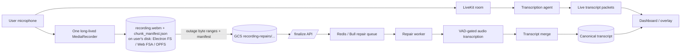
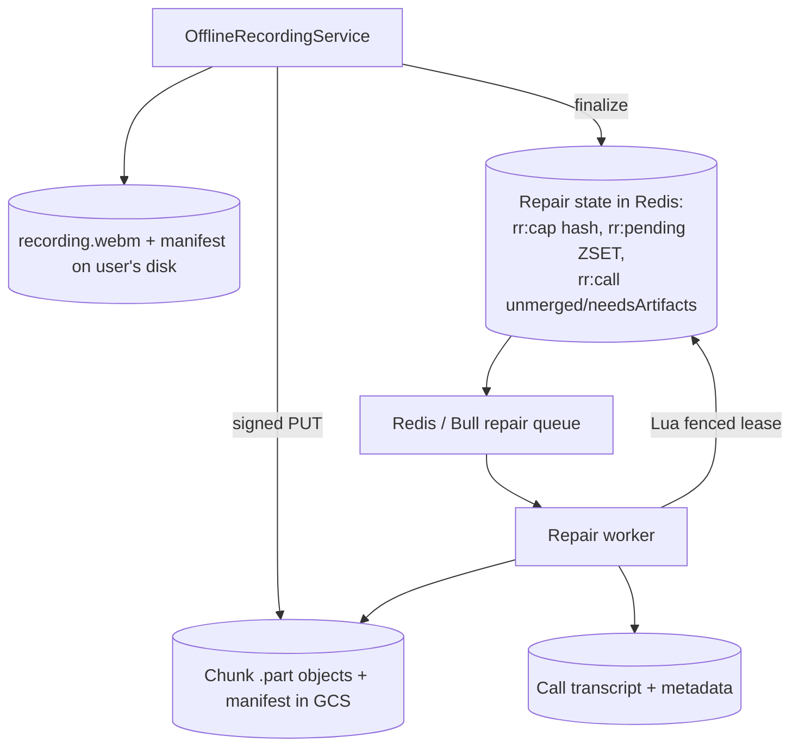
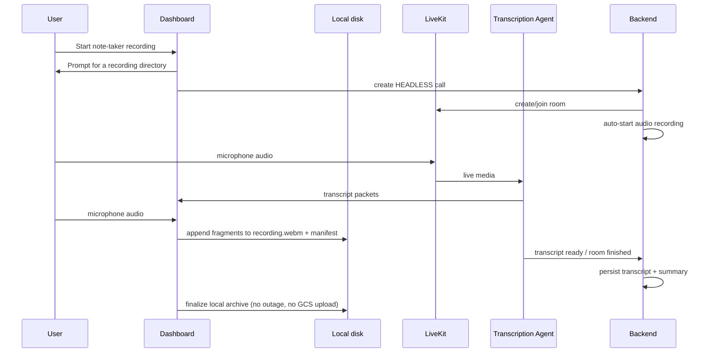
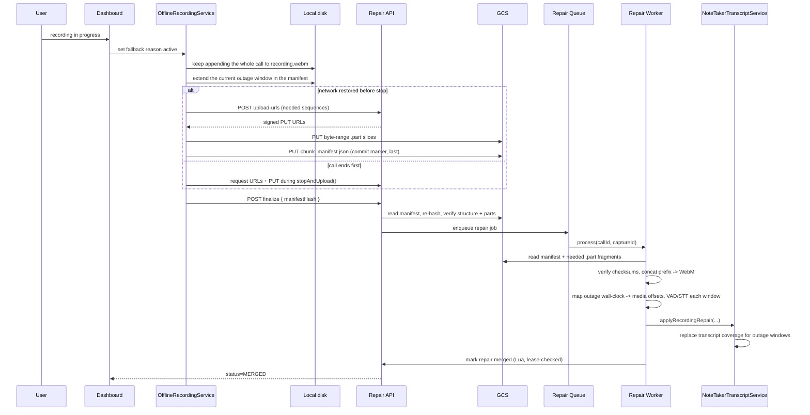

# Local Recording Fallback vs `main`

This document explains the behavior introduced on `feature/local-recording-fallback` relative to `origin/main`.

The branch turns Xyne Scribe / note-taker (`HEADLESS`) recordings into an **offline-first** flow: one long-lived recorder writes the **entire call** to a durable file on the user's own disk, and short LiveKit / browser outages are repaired from that local archive — uploaded straight to GCS and merged back into the canonical transcript after the call ends.

## Scope of change

Compared with `main`, this branch adds five main capabilities:

1. An always-on local recorder that captures the whole call to a user-chosen directory (`recording.webm` + `chunk_manifest.json`), in the web browser (File System Access / OPFS) and in Electron (native filesystem).
2. Signed-URL upload straight to GCS (client PUTs byte-range slices; the manifest is uploaded last as the commit marker) plus a manifest-based finalize API — no backend-proxied multipart.
3. A Redis-only repair control plane (fenced leases, pending index, cleanup) — no Postgres tables.
4. A repair worker that reconstructs the WebM from uploaded fragments, VAD/STT-transcribes each outage window, and merges the text into the canonical transcript.
5. UI/state coordination for outage tracking, the directory prompt, the persistent outage warning, and repair completion.

## High-level behavioral delta

On `main`:

- note-taker recordings depend on the live room and live transcription path
- if audio/transcription drops during a gap, that gap is generally lost

On this branch:

- the browser records the **entire call** locally, always — not only during outages
- outages are recorded into the manifest as time windows; they decide only what gets *uploaded* for repair, not what gets *recorded*
- when connectivity returns (or the call ends), the outage-relevant byte ranges of `recording.webm` are uploaded directly to GCS
- the manifest is uploaded last and acts as the commit marker; finalize enqueues a repair job
- the worker reconstructs the WebM, transcribes the outage windows, and merges the repaired text back into the transcript
- because the full call is always on local disk, the audio survives even if the repair pipeline (Redis / worker) is unavailable

## Main components added or changed

Frontend:

- `apps/dashboard/src/components/Recording/RecordingFallbackCoordinator.tsx`
- `apps/dashboard/src/services/Recording/offlineRecordingService.ts` (offline-first recorder)
- `apps/dashboard/src/services/Recording/archive/` (storage abstraction: `directoryArchive.ts`, `electronStore.ts`, `fsaStore.ts`, `opfsStore.ts`, `directoryHandleStore.ts`, `clientManifest.ts`, `signedUrlUploader.ts`, `uploader.ts`, `settledCaptures.ts`, `index.ts`)
- `apps/dashboard/src/services/Recording/recordingRepairOutages.ts`
- `apps/dashboard/src/services/Recording/recordingService.ts`
- `apps/dashboard/src/stores/recordingStore.ts`
- `apps/dashboard/src/types/electron.d.ts`

Electron:

- `apps/electron/src/services/recording-fs.ts` (main-process filesystem under the user-picked root)
- `apps/electron/src/ipc/handlers.ts` (`recording-fs:*` handlers, sender-trust gated)
- `apps/electron/src/preload.ts` (`window.electronAPI.recordingFs`)

Backend:

- `apps/backend/src/controllers/recordingRepairController.ts` (`upload-urls`, `finalize`, `getStatus`)
- `apps/backend/src/services/recordingRepairStateService.ts` (Redis-only, Lua fenced leases)
- `apps/backend/src/services/recordingRepairStorageService.ts` (signed PUT URLs + manifest/part reads)
- `apps/backend/src/services/recordingRepairService.ts` (fragment reconstruction + merge)
- `apps/backend/src/utils/recordingRepairRedisKeys.ts` (key schema)
- `apps/backend/src/queues/recordingRepairQueue.ts`
- `apps/backend/src/workers/recordingRepairWorker.ts`
- `apps/backend/src/services/noteTakerTranscriptService.ts`
- `apps/backend/prisma/schema.prisma` + migration `20260817120000_drop_recording_repair_tables` (drops `recording_repair_captures` + `recording_repair_call_states`)

Shared storage/runtime:

- `packages/shared/src/recording/manifest.ts` (manifest schema + `serializeManifestForHash`, `validateManifestStructure`, `neededChunkSequences`)
- `packages/storage/src/types.ts` (`generateUploadSignedUrl`)
- `packages/storage/src/gcsService.ts`, `gcsAdapter.ts`, `s3StorageService.ts`
- `scripts/setup-gcs-recording-cors.sh` (ops: bucket CORS for web PUTs)

## Architecture summary

The branch runs a second, offline-first recording path alongside the normal note-taker flow:

- live path: LiveKit room → transcription agent → canonical transcript
- local path: one long-lived MediaRecorder → `recording.webm` + `chunk_manifest.json` on the user's disk → (on outage) signed PUT to GCS → repair worker → transcript merge

Key properties:

- **One recorder for the whole call.** A single `MediaRecorder` (10s timeslice, 48 kbps Opus to match LiveKit) runs for the entire call. Microphone switches pipe the new track through a stable Web Audio `MediaStreamAudioDestinationNode`, so the recorder never restarts and every fragment concatenates into one valid WebM.
- **Manifest is the source of truth.** Each fragment appends bytes to `recording.webm` and adds a descriptor (`sequence`, `byteOffset`, `byteLength`, `startedAtMs`, `endedAtMs`, `sha256`) to `chunk_manifest.json`, alongside `outages[]`, `markedMoments[]`, and `offlineAtStart`.
- **Direct filesystem, both runtimes.** Electron uses native FS via new IPC; the web uses the File System Access API; OPFS is a fallback only. Audio bytes never pass through IndexedDB (IndexedDB holds only the FSA directory *handle*).
- **Direct-to-GCS.** The backend signs short-lived PUT URLs after the ownership check; the client PUTs byte-range slices straight to GCS (web via `fetch`/`axios` PUT + bucket CORS; Electron PUTs from the main process, bypassing CORS). No GCS credentials ever reach the client.
- **Redis-only control plane.** All repair state, fenced leases, the pending index, and cleanup live in Redis. If Redis is lost the transcript job is forfeit, but the user still holds the full local recording.

## Local archive layout

Per capture, under the user's chosen directory (Electron: `{root}/Xyne Recordings/{captureId}/`):

- `recording.webm` — the full-call audio, appended fragment-by-fragment
- `chunk_manifest.json` — the manifest (byte ranges, checksums, outages, marked moments, upload status, `manifestHash`)

GCS layout for repair uploads: `recording-repairs/{callId}/{captureId}/chunks/{sequence}.part` + `/chunk_manifest.json`.

## DFD: end-to-end note-taker recording with fallback

## DFD: repair-state persistence

## Sequence: happy path without outage

## Sequence: outage and repair path

## Runtime flow by layer

### 1. Frontend outage detection

The dashboard marks outage windows only for definitive recording-path loss:

- LiveKit reaches terminal `Disconnected` (ordinary `Reconnecting` is not marked as an outage)
- a previously connected transcription agent remains absent past its confirmation delay
- `offlineAtStart` is set when the call begins with no connectivity

Browser offline/reconnecting and individual STT provider errors do not, by themselves, force a repair. Recording continues regardless; outages only widen the byte range that will be uploaded. During an incident the dashboard shows a persistent, yellow, user-dismissible warning that local capture is active and the transcript will be repaired later. Reasons are accumulated in store state and mirrored into `OfflineRecordingService`, which writes them into the manifest's `outages[]`.

### 2. Frontend local capture

`OfflineRecordingService`:

- runs one long-lived `MediaRecorder` over a stable Web Audio destination for the whole call
- pins fallback Opus capture to 48 kbps, matching LiveKit's default mono publish ceiling
- appends each `dataavailable` fragment to `recording.webm` and records its byte range + `sha256` in the manifest, serialized on a per-capture mutation tail
- live-extends the active outage window on every fragment so a crash still leaves a coherent window
- switches to a newly published microphone track without restarting the recorder or changing capture identity
- uses native `pause()`/`resume()` when the call is paused
- monitors device free space (Electron `statfs` / OPFS `navigator.storage.estimate()`) and warns / stops before the volume fills
- recovers pending captures on startup and browser `online`, re-uploading anything not yet settled
- keeps a local "settled captures" set so archives the user chose to keep are not re-uploaded after server-side purge

Selection order for the storage backend: Electron native FS → Web File System Access → OPFS.

### 3. Backend capture finalization

`recordingRepairController`:

- `POST …/upload-urls` — after the `getOwnedHeadlessCall` ownership check, returns short-lived signed PUT URLs for the requested chunk sequences plus the manifest
- `POST …/finalize` — accepts `{ manifestHash }`, **derives** the manifest path server-side (never trusts a client path), reads the manifest from GCS, re-hashes it via `serializeManifestForHash` to confirm integrity, validates structure, and confirms the needed contiguous prefix of `.part` objects is present; then writes Redis capture state (`FINALIZED`, adds to `rr:pending` + `rr:call:{callId}:unmerged`) and enqueues the job
- `GET …/:captureId` — repair status

There is no multipart chunk upload endpoint and no multer on this path anymore.

### 4. Backend repair processing

`recordingRepairWorker` + `recordingRepairQueue` + `recordingRepairService`:

- recover pending repair jobs from `rr:pending` (ZSET) — no SQL scan
- claim under a Lua fenced lease (only `FINALIZED` / retryable-`FAILED` / expired-`PROCESSING` → `PROCESSING` with a fresh `leaseId`)
- download the manifest and the needed fragments (the contiguous prefix `[0..last-outage-chunk]`, or all fragments when `offlineAtStart`)
- verify each fragment's `sha256` and `byteLength`, then concatenate in sequence order into a single valid WebM (fragments are MediaRecorder pieces, not independently playable — this replaces the old per-chunk standalone-WebM gate with an assembled-header check)
- map each outage's wall-clock window to media offsets via `wallToMediaMs` (summing fragment spans so recorder-pause gaps don't skew the slice)
- run local Silero VAD and skip billable STT for windows without speech
- transcribe VAD-admitted windows and merge via `noteTakerTranscriptService.applyRecordingRepair`
- mark `MERGED` (lease-checked) and delete GCS objects after `refreshRecordingArtifacts`, or `FAILED` (retryable flag) on error

## Storage model

Frontend local (user's disk, source of durability):

- `recording.webm` — full-call audio
- `chunk_manifest.json` — manifest / control record
- IndexedDB holds only the Web FSA directory *handle* (never audio); `localStorage` holds the settled-captures set

Backend transient:

- Bull job reference in Redis
- Repair control state in Redis (`rr:cap:*` hash, `rr:pending` ZSET, `rr:call:*` sets/flags)

Backend object storage:

- `recording-repairs/<callId>/<captureId>/chunks/<sequence>.part` + `chunk_manifest.json`, deleted after a successful merge + artifact refresh
- canonical transcript storage remains the source of truth after merge

There is **no** repair state in Postgres. The `recording_repair_captures` and `recording_repair_call_states` tables are dropped by migration.

## State model

Repair status (Redis `rr:cap:{callId}:{captureId}` hash):

- `FINALIZED`
- `PROCESSING` (holds a fenced `leaseId` + expiry)
- `MERGED`
- `FAILED` (with a `retryable` flag)

Idempotency is keyed on `manifestHash`. Flush-protection: pending/processing keys carry no eviction-eligible TTL — only terminal keys (`MERGED` + artifacts refreshed, or non-retryable `FAILED`) get a retention TTL. This is the "written logic on what gets flushed" that makes the pure-Redis control plane safe under normal operation.

Frontend fallback availability:

- `ready`
- `unavailable`

## Main request/response additions

New client methods (`recordingService.ts`):

- request repair upload URLs (`requestRecordingRepairUploadUrls`)
- finalize repair capture (`finalizeRecordingRepair(callId, captureId, manifestHash)`)
- fetch repair status

New backend routes:

- `POST /calls/:callId/recording-repairs/:captureId/upload-urls`
- `POST /calls/:callId/recording-repairs/:captureId/finalize`
- `GET /calls/:callId/recording-repairs/:captureId`

(The old `PUT …/chunks/:sequence` multipart route is removed.)

## Operational requirements

This branch requires the following for repaired audio to appear:

- dashboard runtime supports a local filesystem sink: Electron native FS, Web File System Access, or OPFS
- GCS bucket CORS is applied for web direct-PUT (`scripts/setup-gcs-recording-cors.sh`; not needed for Electron, which PUTs from the main process)
- repair object storage configured (`TRANSCRIPTION_BUCKET_NAME`)
- Redis available for repair state + queue
- repair worker running (`ENABLE_RECORDING_REPAIR_WORKER=true`)
- transcription service exposes the VAD-gated `/transcribe-recording-repair` endpoint
- transcription-agent image includes FFmpeg for exact outage trimming

Without the repair worker (or Redis), the full call is still captured locally and can be uploaded; it just will not be merged into the transcript until the pipeline recovers.

## Environment

No new backend environment variables are required. The repair path reuses existing config:

- `TRANSCRIPTION_BUCKET_NAME` — GCS bucket for repair objects
- `ENABLE_RECORDING_REPAIR_WORKER` — worker toggle
- signed-URL expiry is a fixed 15-minute constant in `recordingRepairStorageService`
- web PUT CORS is applied out-of-band by `scripts/setup-gcs-recording-cors.sh`

## What does not change

- note-taker recordings are still `HEADLESS` calls
- canonical transcript persistence remains the backend source of truth
- regular in-call recording and stitch flows still use `call_recordings`

## Current safeguards in this branch

- stale repair recovery is kicked off in the background so a leftover capture does not block arming capture for a new call
- finalize derives the manifest path server-side, re-hashes the uploaded manifest, and rejects it unless the needed contiguous prefix of chunks is present
- the worker re-verifies every fragment's checksum before reconstruction and rejects a decoded window whose duration disagrees with the manifest
- transcript replacement is limited to the intersection of reconstructed coverage and finalized outage windows
- Electron PUTs are restricted to https `googleapis`/`amazonaws` hosts, `captureId` is path-sanitized, and IPC is gated on a trusted sender

## Remaining risk areas

- repair merge still depends on transcription quality; a valid merge can still produce coarse text if the recovered audio is noisy
- repair completion still depends on Redis, repair storage, and the repair worker all being available after call end (the local `recording.webm` is the backstop if they are not)
- a recorder pause *inside* an outage window mis-maps that window's internal segment timestamps (rare; pre-outage pauses are handled correctly by `wallToMediaMs`)
- first-time Web FSA users need a user gesture for `showDirectoryPicker`; wiring the directory prompt into the record-button click is a tracked follow-up (Electron and returning FSA users are unaffected)

## Suggested verification checklist

1. **Happy/no-outage (web + Electron):** start note-taker → prompted for a directory → `recording.webm` + `chunk_manifest.json` grow → stop → archive finalized locally → no GCS upload / repair.
2. **Outage repair:** force a terminal LiveKit disconnect → outage window written to the manifest → restore connectivity → chunk `.part`s + manifest PUT to GCS → finalize enqueues → worker reconstructs + VAD + STT + merge → Redis `FINALIZED → PROCESSING → MERGED` → repaired text + regenerated summary appear.
3. **Offline-from-start:** begin offline → whole call recorded locally (`offlineAtStart:true`) → on reconnect upload everything → full transcript generated.
4. **Crash/reload mid-call:** reload → resume from the last durable fragment; no fictional coverage past a closed fragment.
5. **Mic switch mid-call:** replace input device → single continuous `recording.webm`, no recorder restart.
6. **Redis lease contention:** two workers → exactly one claims; a killed worker's lease expires and is reclaimed.
7. **Redis flush guard:** flush Redis with a pending capture staged → the key lifecycle prevents eviction of unprocessed captures; if Redis is truly down, the local `recording.webm` remains intact.
8. **Cleanup:** after transcript + artifacts, GCS chunks + manifest deleted; terminal Redis keys expire on retention.
9. Changed-file lint + touched-file typecheck + `git diff --check` clean; `recordingRepairService.test.ts` + Redis/reconstruction tests pass.
