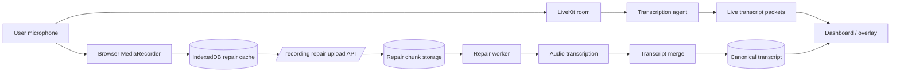
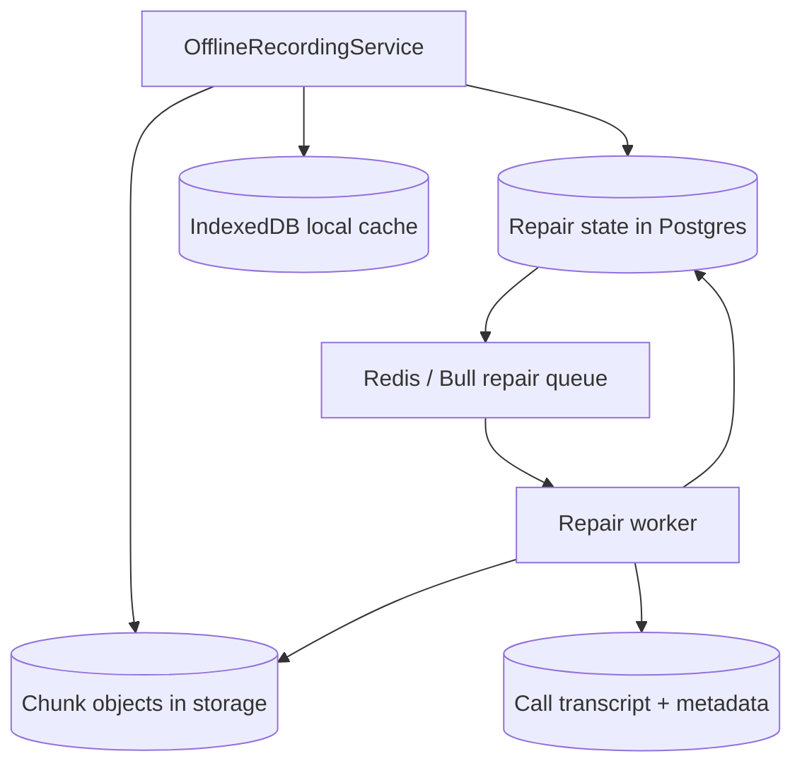
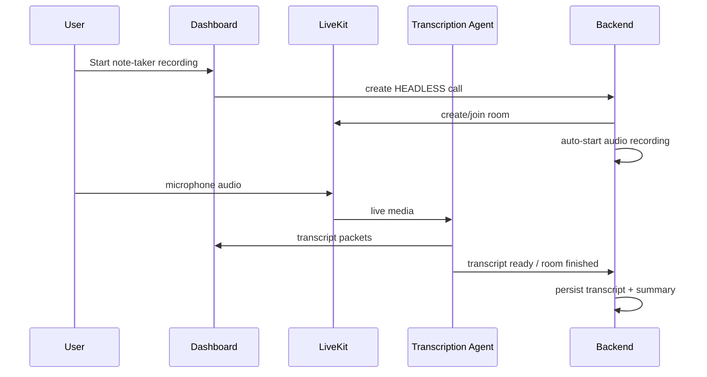
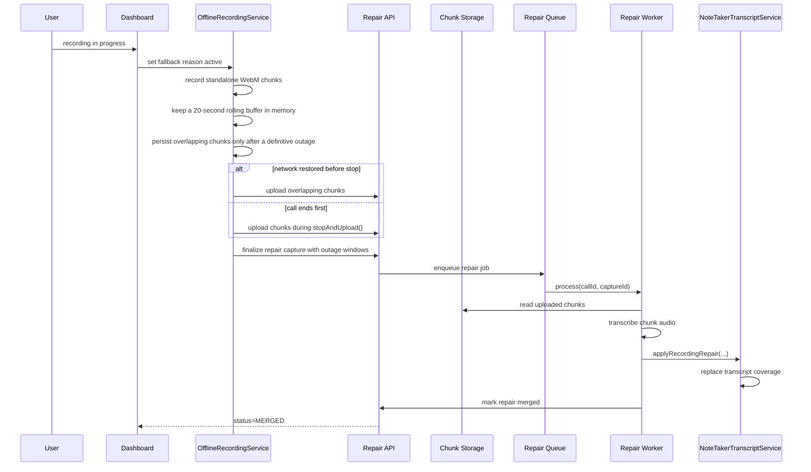

# Local Recording Fallback vs `main`

This document explains the behavior introduced on `feature/local-recording-fallback` relative to `origin/main`.

The branch adds a repair path for Xyne Scribe / note-taker (`HEADLESS`) recordings so short LiveKit / browser outages can be recovered from browser-local audio and merged back into the canonical transcript after the call ends.

## Scope of change

Compared with `main`, this branch adds four main capabilities:

1. Browser-local fallback capture during outages
2. Upload/finalize/status APIs for repair chunks
3. Queue/worker-based transcription merge for repair audio
4. UI/state coordination for outage tracking and repair completion

## High-level behavioral delta

On `main`:

- note-taker recordings depend on the live room and live transcription path
- if audio/transcription drops during a gap, that gap is generally lost

On this branch:

- the browser records local audio chunks during outage windows
- those chunks are uploaded after connectivity returns or when the call ends
- backend transcribes the uploaded chunks
- backend merges the repaired text back into the note-taker transcript

## Main components added or changed

Frontend:

- `apps/dashboard/src/components/Recording/RecordingFallbackCoordinator.tsx`
- `apps/dashboard/src/services/Recording/offlineRecordingService.ts`
- `apps/dashboard/src/services/Recording/recordingRepairOutages.ts`
- `apps/dashboard/src/services/Recording/recordingService.ts`
- `apps/dashboard/src/stores/recordingStore.ts`
- `apps/dashboard/src/routes/RecordingsV2Screen/components/NoteTakerOverlayHost.tsx`

Backend:

- `apps/backend/src/controllers/recordingRepairController.ts`
- `apps/backend/src/services/recordingRepairStateService.ts`
- `apps/backend/src/services/recordingRepairStorageService.ts`
- `apps/backend/src/services/recordingRepairService.ts`
- `apps/backend/src/queues/recordingRepairQueue.ts`
- `apps/backend/src/workers/recordingRepairWorker.ts`
- `apps/backend/src/services/noteTakerTranscriptService.ts`

Shared storage/runtime:

- `packages/storage/src/types.ts`
- `packages/storage/src/gcsAdapter.ts`
- `packages/storage/src/gcsService.ts`
- `packages/storage/src/s3StorageService.ts`

## Architecture summary

The branch introduces a second recording path alongside the normal note-taker flow:

- live path: LiveKit room -> transcription agent -> canonical transcript
- repair path: browser MediaRecorder -> IndexedDB -> repair upload API -> repair worker -> transcript merge

## DFD: end-to-end note-taker recording with fallback

## DFD: repair-state persistence

## Sequence: happy path without outage

## Sequence: outage and repair path

## Runtime flow by layer

### 1. Frontend outage detection

The dashboard activates durable fallback only for definitive recording-path loss:

- LiveKit reaches terminal `Disconnected` (ordinary `Reconnecting` remains memory-only)
- a previously connected transcription agent remains absent past its confirmation delay

Browser offline/reconnecting and individual STT provider errors do not persist audio.
STT failure/recovery events carry a session-specific source id so recovery from one
session cannot clear another session's failure.
During a browser-offline or LiveKit reconnect/disconnect incident, the dashboard shows
a persistent, yellow, user-dismissible warning that local capture is active and the
transcript will be repaired later.

These reasons are accumulated in store state and mirrored into `OfflineRecordingService`.

### 2. Frontend local capture

`OfflineRecordingService`:

- creates standalone WebM chunks with one MediaRecorder lifecycle per chunk
- pins fallback Opus capture to 48 kbps, matching LiveKit's default mono publish ceiling
- keeps healthy/reconnecting audio in a bounded 20-second memory buffer
- begins IndexedDB persistence only when a definitive outage is confirmed
- silently estimates origin storage capacity and warns when less than roughly two hours remain
- deletes a local chunk only after its checksummed upload is acknowledged by the backend
- on quota exhaustion, drains acknowledged chunks and removes only disposable local captures before retrying the failed write
- switches to a newly published microphone track without changing capture identity
- resolves IndexedDB writes only after their containing transaction commits
- retries unfinished uploads/finalization on startup and browser `online`

### 3. Backend capture finalization

`recordingRepairController`:

- accepts repair chunk uploads
- validates finalized outage windows
- creates durable repair state in Postgres
- enqueues a repair job

### 4. Backend repair processing

`recordingRepairWorker` + `recordingRepairQueue`:

- recover pending repair jobs
- trim each chunk to the exact outage intersection
- run local Silero VAD and skip billable STT for intervals without speech
- transcribe only VAD-admitted repair intervals
- merge text into the canonical transcript
- mark repair state `MERGED` or `FAILED`

## Storage model

Frontend local:

- IndexedDB `captures`
- IndexedDB `chunks`

Backend transient:

- Bull job reference in Redis

Backend durable:

- repair capture state in Postgres (`recording_repair_captures`)
- object storage under `recording-repairs/<callId>/<captureId>/...`
- canonical transcript storage remains the source of truth after merge

## State model introduced

Repair status:

- `FINALIZED`
- `PROCESSING`
- `MERGED`
- `FAILED`

Frontend fallback availability:

- `ready`
- `unavailable`

## Main request/response additions

New client methods:

- upload repair chunk
- finalize repair capture
- fetch repair status

New backend routes:

- `PUT /calls/:callId/recording-repairs/:captureId/chunks/:sequence`
- `POST /calls/:callId/recording-repairs/:captureId/finalize`
- `GET /calls/:callId/recording-repairs/:captureId`

## Operational requirements

This branch requires the following to be healthy for repaired audio to appear:

- dashboard browser supports `MediaRecorder`
- IndexedDB available
- repair chunk storage configured
- Redis available for repair state + queue
- repair worker running
- transcription service exposes the VAD-gated `/transcribe-recording-repair` endpoint
- transcription-agent image includes FFmpeg for exact outage trimming

Without the repair worker, fallback audio can be captured and uploaded, but it will not be merged into the transcript.

## What does not change

- note-taker recordings are still `HEADLESS` calls
- canonical transcript persistence remains the backend source of truth
- regular in-call recording and stitch flows still use `call_recordings`

## Current safeguards in this branch

- stale repair recovery is kicked off in the background so a leftover capture does not block arming fallback capture for a new call
- finalize rejects repairs unless uploaded chunk coverage spans each finalized outage interval end-to-end
- transcript replacement is limited to the intersection of selected chunk coverage and finalized outage windows

## Remaining risk areas

- repair merge still depends on chunk transcription quality; a valid merge can still produce coarse text if the recovered audio is noisy
- repair completion still depends on Redis, repair storage, and the repair worker all being available after call end
- long-lived local failures are retained in IndexedDB for retry, so operator visibility into repeated `FAILED` states remains important

## Suggested verification checklist

- start a note-taker recording and keep network healthy
- force a temporary browser/LiveKit reconnect and verify current-call chunks are not written to IndexedDB
- force terminal LiveKit disconnection or confirmed agent departure
- verify only outage-overlapping chunks are written to IndexedDB
- restore connectivity
- stop the call
- verify repair state transitions `FINALIZED -> PROCESSING -> MERGED`
- verify repaired transcript appears in recording detail
- verify summary regeneration still works after merge
