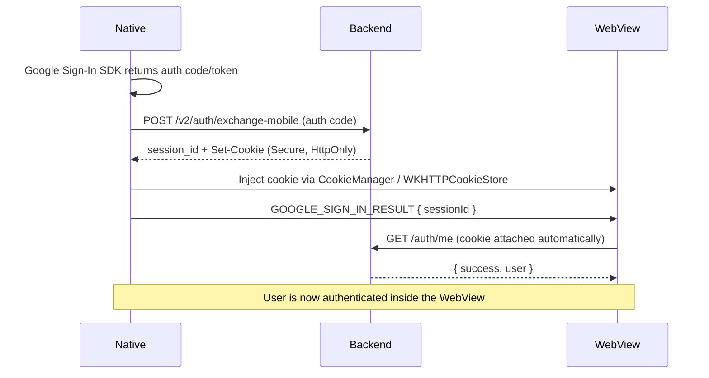

# Secure Native Cookie Injection Plan

This doc explains the strategy for authenticating the dashboard when it runs inside the React Native WebView. Native keeps full control of Google credentials while the dashboard relies solely on HTTP-only cookies, matching the desktop/browser behavior. Implementation can start once these requirements are met.

## Goals
- Keep Google tokens and backend refresh tokens out of the WebView JavaScript context.
- Rely on Secure/HttpOnly/SameSite=None cookies for all authenticated API calls.
- Minimize special-case logic in the dashboard; once the cookie exists, `/auth/me` should work unchanged.

## Flow Overview
1. Native app completes Google Sign-In (or any IdP) via platform SDKs.
2. Native calls `POST /v2/auth/exchange-mobile` with the Google auth code and receives an opaque `session_id` from the backend.
3. Native injects the cookie into the WebView:
   - **Android**: `CookieManager.getInstance().setCookie("https://app.xynehq.com", "session_id=<opaque>; Path=/; Secure; HttpOnly; SameSite=None"); CookieManager.getInstance().flush();`
   - **iOS**: create a `HTTPCookie` with the same attributes and store it via `WKHTTPCookieStore` before loading the dashboard URL.
4. Native sends a `GOOGLE_SIGN_IN_RESULT` message over the bridge with `{ success: true, sessionId: '<opaque>', userId: '<uuid>' }` to confirm the cookie is ready.
5. Dashboard calls `/auth/me`, receives the authenticated user (cookie rides along automatically), and hydrates local state.

### Sequence Diagram

## Backend Requirements
- Exchange endpoint validates Google credentials, mints `session_id`, and sets the cookie attributes `Secure; HttpOnly; SameSite=None; Path=/`.
- JSON response can include `{ sessionId, user }` for logging, but the cookie itself should be delivered via real HTTP headers.
- `/auth/me` and `/auth/refresh-session` must rely solely on cookies so that WebView behavior matches desktop browsers.

## Native Work Items
- [x] Exchange the Google auth code natively and inject cookies into the shared store (see `apps/xyne-spaces/src/components/XyneWeb.tsx:exchangeCodeAndInjectSession`).
- [x] Ensure cookie injection happens before the WebView reports success back to the dashboard.
- [x] Require successful cookie injection before emitting `GOOGLE_SIGN_IN_RESULT` (no legacy fallback).

## Dashboard Work Items
- [x] Consume `payload.sessionId` to bootstrap sessions via `/auth/me`.
- [x] Remove the legacy `persistNativeSession(serverAuthCode)` fallback path.
- [ ] Add logging around session bootstrap to correlate native `sessionId` with backend telemetry.

## Testing Checklist
1. Trigger native sign-in on a device/simulator and watch the WebView console: expect `[AUTH] Native host reported ready`.
2. After cookie injection, `/auth/me` should return HTTP 200 immediately; if not, verify cookie attributes via DevTools > Application > Cookies.
3. Confirm cookies are marked Secure + HttpOnly and scoped to the dashboard domain.

## Next Steps
- Finalize backend telemetry to correlate native `sessionId` values with server logs.
- Roll out the updated native apps and monitor `/auth/me` success rates.
