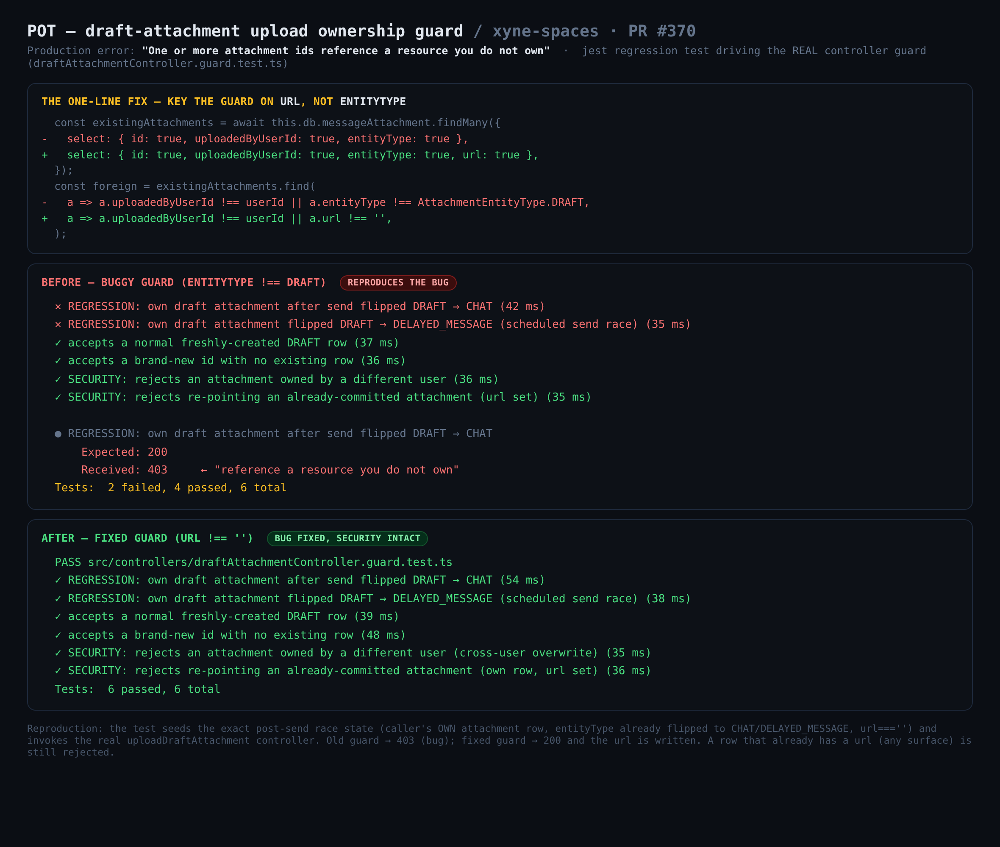

# POT — draft attachment upload ownership guard

Fix for the production error **"One or more attachment ids reference a resource you do not own"** on
`POST /api/drafts/attachments/upload`.



## How the issue was reproduced

The bug is a race: the dashboard fires the Zero create-attachment mutator and the REST upload
**concurrently** (`apps/dashboard/src/hooks/useDraft.ts`). If the user sends (or schedules) the message
before a large/slow upload finishes, the Zero create-message mutator flips the **same user's** attachment
row `entityType` `DRAFT -> CHAT` (`apps/backend/src/zero/mutators.ts:2417-2432`) or
`DRAFT -> DELAYED_MESSAGE`. The in-flight upload's ownership `SELECT` then runs against that already-flipped
row, and the old guard treated the user's **own** row as foreign — returning a 403 that aborted the whole
batch before any file `url` was written.

Reproducing this against a live browser is timing-dependent and flaky. Instead, the regression test
**deterministically seeds the exact post-send state** and drives the **real controller method**
`DraftAttachmentController.uploadDraftAttachment`:

- inject a fake `db` whose `messageAttachment.findMany` returns the caller's OWN row with
  `entityType` already set to `CHAT` / `DELAYED_MESSAGE` and `url === ''` (the upload is the writer that
  fills `url`);
- capture the controller's HTTP status via a fake `res`.

This exercises the actual guard code path (not a copy of the predicate). See
`apps/backend/src/controllers/draftAttachmentController.guard.test.ts`.

## Red → green (same test, guard toggled)

**BEFORE** (old guard `entityType !== DRAFT`) — the two race cases fail with the exact production symptom:

```
✕ REGRESSION: own draft attachment after send flipped DRAFT → CHAT
✕ REGRESSION: own draft attachment flipped DRAFT → DELAYED_MESSAGE (scheduled send race)
✓ accepts a normal freshly-created DRAFT row
✓ accepts a brand-new id with no existing row
✓ SECURITY: rejects an attachment owned by a different user
✓ SECURITY: rejects re-pointing an already-committed attachment (url set)

  ● REGRESSION: own draft attachment after send flipped DRAFT → CHAT
    Expected: 200
    Received: 403     ← "reference a resource you do not own"
Tests: 2 failed, 4 passed, 6 total
```

**AFTER** (fixed guard `url !== ''`) — bug gone, both security cases still reject:

```
PASS src/controllers/draftAttachmentController.guard.test.ts
✓ REGRESSION: own draft attachment after send flipped DRAFT → CHAT
✓ REGRESSION: own draft attachment flipped DRAFT → DELAYED_MESSAGE (scheduled send race)
✓ accepts a normal freshly-created DRAFT row
✓ accepts a brand-new id with no existing row
✓ SECURITY: rejects an attachment owned by a different user (cross-user overwrite)
✓ SECURITY: rejects re-pointing an already-committed attachment (own row, url set)
Tests: 6 passed, 6 total
```

## Run it

```
cd apps/backend
NODE_OPTIONS=--max-old-space-size=6144 npx jest src/controllers/draftAttachmentController.guard.test.ts --runInBand
```
