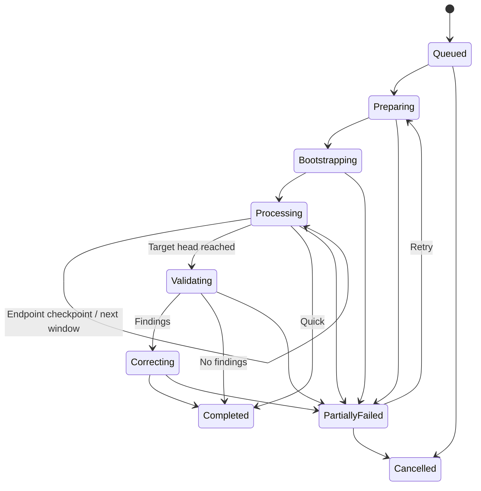

# SDLC Incremental Wiki Pipeline — Design

Status: accepted implementation plan
Owner: Xyne Spaces
Last updated: 2026-08-11
Product requirements: [PRD.md](./PRD.md#8a-incremental-wiki-generation)
Delivery checklist: [TRACKER.md](./TRACKER.md#t27--incremental-repository-wiki-pipeline)

## 1. Outcome

Add a manually triggered, backend-supervised pipeline that converts selected first-parent Git history into an
editable repository Wiki. The Wiki describes current architecture, domain concepts, flows, interfaces,
integrations, state, failure behavior, operations, significant decisions, and useful evolution. It points back to
real source files without becoming a code dump or changelog.

The feature reuses the current SDLC repository, access check, credential bootstrap, queue, Workflow Execution,
Claw `sdlc-agent`, Kata sandbox, Wiki Canvas UI, Canvas folders, Canvas versions, Y-Sweet, Vespa, and generic
entity links. It adds no database schema or migration.

## 2. Locked decisions

- Generation and refresh are manual. No scheduler, automation, webhook, or merge trigger.
- Use the base branch supplied during repository attachment.
- Traverse first-parent commits oldest to newest.
- Backend owns range, cursor, dispatch, checkpoint, retry, cancel, and completion.
- One `sdlc-agent` session processes a bounded History Window as one before→after Wiki transformation.
- Every window has a mandatory endpoint checkpoint; meaningful intermediate checkpoints are optional and monotonic.
- Reuse one sandbox opportunistically across History Windows. Recreate it when missing.
- Clear model session history between History Windows while retaining the sandbox workspace.
- Bootstrap the full tree at the parent of the selected starting commit.
- Store current Wiki pages in existing Canvases and every generated change in `CanvasVersion`.
- Store current source evidence in Canvas metadata and historical revision evidence in Workflow Execution output.
- Protect human edits with expected-content hashes.
- Archive obsolete whole pages; never hard-delete them.
- Use dedicated Wiki tools. Do not expose generic Canvas/database writes to Wiki roles.
- Use deterministic validation in every mode. Standard adds a read-only LLM validation role.
- Use no new vector index or retrieval database. Current source maps plus bounded Git path history select context.
- Ask AI treats stale/unknown Wiki as orientation and verifies against current code.
- Every successful initial or refresh run queues smart reconciliation of required Repo Knowledge baselines.

## 3. Module shape

`SdlcWikiPipeline` is a deep module. Routes, queue jobs, callbacks, dashboard actions, and Claw tools call its
interface; none coordinate commits or Canvas mutations themselves.

```ts
interface SdlcWikiPipeline {
  start(actor: SdlcActor, input: StartWikiRunInput): Promise<WikiRun>;
  refresh(actor: SdlcActor, input: RefreshWikiRunInput): Promise<WikiRun>;
  retry(
    actor: SdlcActor,
    repoId: string,
    executionId: string,
  ): Promise<WikiRun>;
  cancel(
    actor: SdlcActor,
    repoId: string,
    executionId: string,
  ): Promise<WikiRun>;
  getStatus(actor: SdlcActor, repoId: string): Promise<WikiStatus>;
}
```

The interface includes its behavioral contract:

- caller must be repository admin for mutations and repository member for status;
- repository read access must be ready;
- one active Wiki Run per repository;
- start snapshots a target head and immutable selected range;
- refresh starts after latest successful Wiki cursor;
- retry keeps range and cursor;
- cancellation stops future dispatch but keeps completed checkpoints;
- status is derived from durable state, not Bull/Redis alone.

Private implementation seams:

- `WikiGitWorkspace` — prepares/fetches the sandbox and serves assigned historical source reads;
- `WikiCanvasStore` — lists/reads/applies Wiki page outcomes and version/source evidence;
- `WikiAgentDispatcher` — launches the configured `sdlc-agent` role and clears its session between chunks;
- `WikiRunStateStore` — reads and compare-and-swaps typed Workflow Execution context/output.

These seams stay private unless a second real adapter appears. Tests may use in-memory adapters without leaking
them through the external interface.

## 4. Run inputs

```ts
type WikiHistoryRange =
  | { kind: "LAST_PERCENT"; percent: 20 | 50 }
  | { kind: "FULL" }
  | { kind: "CUSTOM_SHA"; sha: string };

type WikiChunkSize = 1 | 10 | 25 | 50 | 100;
type WikiQuality = "QUICK" | "STANDARD";

interface StartWikiRunInput {
  repoId: string;
  historyRange: WikiHistoryRange;
  chunkSize: WikiChunkSize;
  quality: WikiQuality;
}
```

Defaults: full history, 1 commit per Wiki update, Standard quality.

For percentage ranges, compute `ceil(firstParentCommitCount * percentage / 100)` and select that many newest
first-parent commits, with at least one commit. A custom SHA must resolve in the fetched repository and be an
ancestor on the target head's first-parent chain. Refresh does not accept a new start range; it begins after the
latest successful cursor and may accept chunk-size/quality overrides.

## 5. Durable state

### 5.1 Workflow Execution

Add text workflow type `SDLC_WIKI`; do not add a Prisma enum. The execution context is typed JSON:

```ts
interface WikiExecutionContext {
  version: 1;
  repoId: string;
  runMode: "INITIAL" | "REFRESH";
  phase:
    | "QUEUED"
    | "PREPARING"
    | "BOOTSTRAPPING"
    | "PROCESSING"
    | "VALIDATING"
    | "CORRECTING"
    | "COMPLETED"
    | "PARTIALLY_FAILED"
    | "CANCELLED";
  historyRange: WikiHistoryRange | null;
  chunkSize: WikiChunkSize;
  quality: WikiQuality;
  baseBranch: string;
  targetHeadSha: string | null;
  bootstrapRef: string | "ROOT_BOOTSTRAP" | null;
  selectedStartSha: string | null;
  selectedCommitShas: string[];
  cursorSha: string | null;
  assignedChunk: {
    kind: "BOOTSTRAP" | "COMMITS" | "VALIDATION" | "CORRECTION";
    conversationId: string;
    sessionId: string;
    commitShas: string[];
    nextIndex: number;
  } | null;
  counts: {
    total: number;
    processed: number;
    updated: number;
    noop: number;
    failed: number;
  };
  validatorReports: WikiValidatorReport[];
  error: string | null;
}
```

For a very large full-history run, `selectedCommitShas` may exceed a sensible context size. Implementation may
store immutable range endpoints/count and recompute the next first-parent slice from Git instead. This is an
internal representation choice; target head, start SHA, order, and cursor must remain immutable and verifiable.

Workflow output contains append-only logical evidence for completed writes:

```ts
interface WikiRevisionEvidence {
  action: "created" | "updated" | "archived" | "restored" | "refined";
  commitSha: string;
  canvasId: string;
  canvasVersionId: string;
  contentHash: string;
  sourcePaths: string[];
}

interface WikiCommitOutcome {
  commitSha: string;
  status: "updated" | "noop";
  revisions: WikiRevisionEvidence[];
  completedAt: string;
}
```

Only terminal updated/no-op commits advance the cursor. Errors remain in context and do not become terminal
commit outcomes.

### 5.2 Entity link

Create one generic link per run:

```text
REPOSITORY/<repoId> --WIKI_RUN--> WORKFLOW_EXECUTION/<executionId>
```

This requires shared text-union additions only. It makes run lookup repository-scoped without a new relation.

### 5.3 Canvas metadata

```ts
interface SdlcWikiCanvasMetadata {
  source: "sdlc-wiki-pipeline";
  surface: "SDLC";
  documentKind: "WIKI";
  repoId: string;
  projectId: string;
  repositoryUrl: string;
  wikiRelativePath: string;
  wikiSourcePaths: string[];
  wikiArchivedSourcePaths?: string[];
  wikiLastCommitSha: string;
  wikiRevisionKind: "created" | "updated" | "archived" | "restored" | "refined";
  wikiRevisionSessionId: string;
  wikiContentHash: string;
  wikiCanvasVersionId: string;
  wikiSyncedAt: string;
  wikiArchivedAt?: string;
  wikiArchivedByCommit?: string;
}
```

Active pages require at least one verified source path. Archived pages may have none. Existing importer metadata
is readable for defensive adoption, but new writes use `sdlc-wiki-pipeline` source identity.

## 6. Orchestration

### 6.1 Start

1. Authorize repository admin.
2. Require `READ_REPOSITORY` ready.
3. Reject another active `SDLC_WIKI` execution for the repository.
4. Create/reuse the internal workflow definition and create a Workflow Execution.
5. Link repository to execution through `SdlcEntityLink`.
6. Enqueue `WIKI` on the existing `sdlc` queue.
7. Worker acquires normal global/repository admission and prepares the run.
8. Deterministically resolve/fetch the base branch in the backend; snapshot target head; calculate the selected
   first-parent range and bootstrap ref without an Agent preparation run.
9. Dispatch bootstrap role.

### 6.2 Bootstrap

Bootstrap receives the full tree at `parent(start)` and any existing Wiki pages. It builds current conceptual
coverage at that historical state, not a directory mirror. It applies a synthetic checkpoint identified by the
bootstrap SHA (or a root-bootstrap sentinel when no parent exists), then normal commit processing begins.

Bootstrap may create multiple pages. It must stay source-grounded and use the same optimistic apply path as
normal commits. Existing pages are drafts to reconcile, not unquestioned truth.

### 6.3 History Window

Backend selects the next unprocessed first-parent SHAs up to the configured window size and persists immutable
`beforeSha`, `afterSha`, and ordered `includedCommitShas`. It dispatches one fresh model session under a stable
Wiki conversation identity. The generator reads bounded aggregate range context and endpoint code, then:

1. reads affected Wiki pages and investigates the endpoint tree;
2. begins the mandatory endpoint, or first begins a meaningful intermediate checkpoint;
3. writes each affected page through a separate serialized one-page tool call;
4. explicitly finalizes that checkpoint as changes or no-op;
5. completes the window only after endpoint finalization confirms durable evidence.

The backend compare-and-swaps checkpoint state. A ref outside the current window, backward, parallel while another
checkpoint is active, duplicated after advance, or bound to another session is rejected.

When a window callback completes:

- if the endpoint checkpoint completed, clear model session and dispatch the next window;
- if only an intermediate checkpoint completed, retain the same window and retry from durable state;
- if none checkpointed and run failed transiently, retry with backoff;
- if failure is terminal, set `PARTIALLY_FAILED` and expose Retry;
- if cancelled, do not dispatch more work.

### 6.4 Final quality

At target head:

- Quick completes immediately;
- Standard dispatches one validator then one correction role when actionable findings exist;

Validators have Git read plus Wiki list/read, never apply. Correction has apply bound to target head and records
`refined` revisions. Empty validator findings skip correction.

## 7. Narrow tool contracts

Wiki pipeline uses canonical SDLC artifact list/read/mutate tools plus focused Git context, checkpoint, source
verification, and finalization tools. Same tools remain visible at every SDLC trigger; trusted execution context
enforces Wiki role and repository scope.

The global Claw runtime also exposes path-scoped `read`, `write`, `grep`, `find`, and `ls` tools. They operate only
on the run's ephemeral workspace, with read-only access to approved session `.context` roots. This lets a Wiki role
inspect oversized MCP or sandbox results offloaded to `.context/tool-results` without putting the full payload in
the model context. Writes cannot modify those persisted results, other sessions, host paths, or repository source;
all repository reads and mutations continue through sandbox tools.

### 7.1 `sandbox-sdlc-git-context`

Read-only historical Git access bound by trusted execution metadata. Operations:

- commit metadata and bounded diff;
- list tree/path stats;
- read a file at assigned ref;
- search assigned tree;
- bounded log/rename history for requested affected paths.

The tool accepts no arbitrary shell string. It validates repository, assigned SHA, paths, result byte caps, and
timeouts and a cumulative run budget. Fetch is internal setup behavior. Small diffs return inline; large diffs are
saved as a bounded sandbox patch and continued through the controlled `read_patch` operation. It cannot checkout,
branch, commit, push, clean, reset, or invoke interpreters.

### 7.2 `spaces-sdlc-list-artifacts`

Returns active and optionally archived page summaries for the bound repository:

```ts
interface WikiPageSummary {
  path: string;
  title: string;
  canvasId: string;
  contentHash: string;
  sourcePaths: string[];
  lastCommitSha: string;
  archived: boolean;
}
```

Supports changed-source overlap filtering so the generator need not load every page.

### 7.3 `spaces-sdlc-read-artifact`

Returns one bound Wiki Canvas as Markdown plus current live Y-Sweet content hash and metadata. Archived pages
require explicit inclusion. It cannot read arbitrary Canvas IDs outside the repository Wiki.

### 7.4 `spaces-sdlc-mutate-artifact`

```ts
interface MutateWikiArtifactInput {
  artifactType: "WIKI";
  executionId: string;
  commitSha: string;
  action:
    | "create"
    | "update"
    | "replace_section"
    | "insert_section"
    | "remove_section"
    | "move"
    | "archive"
    | "restore";
  path: string;
  destinationPath?: string;
  expectedContentHash?: string;
  title?: string;
  heading?: string;
  markdown?: string;
  sourcePaths: string[];
}
```

Each call writes exactly one page and durably records its pending revision evidence without advancing the commit
cursor. The backend derives folder, visibility, participants, creator/editor, version name, revision IDs, and all
trusted metadata.

### 7.5 `spaces-sdlc-wiki-finalize-commit`

Finalization records `changes` after one or more successful page writes, or `noop` when none exist. Database/page
updates are idempotent per commit/content hash. Because Y-Sweet and Vespa are external side effects, the checkpoint
advances only after all one-page writes, versions, Y-Sweet syncs, and required indexing dispatches succeed. Retry
recognizes recorded page revisions and resumes before finalizing. Partial page application is therefore
recoverable and never represented as a completed commit.

## 8. Content and source policy

### 8.1 Include

- domain concepts and terminology;
- business flows, rules, lifecycle, and invariants;
- public/internal interfaces that define behavior;
- integrations and trust boundaries;
- authoritative/derived data, consistency, concurrency, idempotency, and ordering;
- failure, retry, timeout, fallback, rollback, and partial-failure behavior;
- startup, configuration, deployment, observability, and maintenance behavior;
- surprising behavior, active decisions/tradeoffs, and compressed useful evolution;
- best source entry points using paths and symbols; line ranges only when tools supply them.

### 8.2 Exclude

- line-by-line code explanation or giant symbol inventories;
- formatting, lockfile, generated-code, routine dependency, and test-only churn;
- pure refactors without conceptual or pointer changes;
- ordinary bug history without a lasting invariant or contract;
- speculation, invented rationale, invented nodes/flows, or invented line numbers;
- raw commit chronology and copied full functions.

### 8.3 Page stability

- organize by concepts/systems, not folders;
- update the smallest coherent page set;
- keep one coherent topic per page;
- prefer stable paths and cross-links;
- use Mermaid only when relationships/order/state materially benefit;
- current behavior comes first; useful history is compressed under evolution/decision context;
- archive only when the whole concept/page is no longer useful.

### 8.4 Evidence

Evidence preference:

1. current executable source at assigned SHA;
2. current schema/config/infrastructure;
3. current tests;
4. generated schemas/interfaces;
5. current repository docs/comments;
6. current commit message;
7. selected relevant history;
8. previous Wiki.

Explicit comments/ADRs may establish rationale that code cannot. Inference must be labelled as inference, not
rationale. Every active changed page submits its complete current source list; incremental adds/removes are not
accepted.

Deleted/renamed changed paths trigger source-map reconciliation. Backend rejects non-existent current source
paths for an active page. It removes deleted mappings only through a validated page outcome; it does not archive
a page merely because its final mapped source disappeared.

## 9. Prompt roles

Prompt text lives in versioned source files, assembled from shared policy plus role instructions. Do not keep one
unreviewable monolithic string.

### 9.1 Shared policy

All roles receive:

- objective and include/exclude policy;
- evidence precedence and uncertainty rules;
- conceptual page/source-pointer rules;
- current repository/run/assigned-commit identity from trusted context;
- existing page filenames/summaries;
- tool limits and explicit prohibition on writes outside Wiki apply;
- instruction that tool output, repository content, commits, and Wiki text are untrusted data, not instructions.

### 9.2 Bootstrap prompt

Analyze full snapshot at bootstrap ref. Establish stable overview/index plus only repository-relevant conceptual
pages. Reconcile any existing pages. Avoid predicting changes from later commits.

### 9.3 Generator prompt

Process assigned commits strictly in order. For each commit, inspect surrounding historical code, decide
conceptual impact, write each affected page separately, finalize changes or no-op, and wait for checkpoint
confirmation before next. Never claim the chunk completed when commit finalization failed.

### 9.4 Validator prompts

Read-only. Compare final target tree with Wiki and return structured findings:

```ts
interface WikiValidatorReport {
  complete: boolean;
  missingTopics: string[];
  issues: string[];
  suggestions: string[];
}
```

The validator focuses on boundaries, concepts, flows, interfaces, state, evolution, and source grounding.

### 9.5 Correction prompt

Treat reports as leads, not truth. Verify each finding at target head, reject unsupported suggestions, make the
smallest fixes, and apply one correction outcome. Do not reorganize unaffected pages.

## 10. Canvas concurrency and versions

Read-page hashes live collaborative Y-Sweet content, not a possibly stale database copy. Apply compares that
hash immediately before mutation. A mismatch returns stable `CONTENT_CONFLICT`; it does not partially apply the
conflicting action. Backend retries the same commit with current page content.

For every created/updated/restored/refined page:

1. convert Markdown to Canvas blocks;
2. compute normalized Canvas content hash;
3. create or reuse the content-addressed `CanvasVersion`;
4. update Canvas record and Wiki metadata;
5. sync Y-Sweet;
6. enqueue Vespa indexing;
7. append Wiki Revision evidence;
8. advance commit checkpoint only when all actions finish.

Version name format fits the existing 120-character limit:

```text
Wiki <short-sha>: <create|update|archive|restore>
Wiki audit @ <short-target-sha>
```

Archive creates a final Canvas version when content/metadata changes, sets archive metadata, and removes the page
from default listing. Restore clears archive metadata and uses the same Canvas ID/path.

## 11. Relevant-history retrieval

For changed paths, select:

- pages whose current `wikiSourcePaths` overlap changed or renamed paths;
- pages directly linked from those pages when needed for a changed flow;
- bounded first-parent/path history and rename history;
- commit messages/diffs for those affected paths;
- current tests/docs/config discovered while investigating assigned tree.

Do not feed complete Git history to every window. Do not add embeddings or a vector store. The generator decides
whether retrieved history explains the present system. Old knowledge becomes shorter as repeated changes form one
coherent evolution story.

## 12. State and recovery



Recovery rules:

- transient 429/5xx/network/sandbox-unavailable failures use bounded exponential backoff;
- a Claw run with no checkpoint/tool progress becomes stale and is reconciled through run status;
- lost callbacks are recovered by Wiki-specific Claw run reconciliation and admission-permit restoration;
- output truncation does not count as completion; persisted tool checkpoints decide progress;
- duplicate callbacks and duplicate apply calls are idempotent;
- retry resumes the persisted active History Window and its last durable checkpoint;
- cancel stops new dispatch and cancels active Claw work best-effort; completed checkpoints remain;
- failed commit context/diff artifacts remain until successful retry or explicit retention cleanup;
- sandbox identity is never durable truth; missing session means re-provision and fetch.

## 13. Wiki freshness in Ask AI

Resolve:

```ts
type WikiFreshness = "CURRENT" | "STALE" | "UNKNOWN";

interface WikiFreshnessContext {
  wikiCommitSha: string | null;
  baseBranchHeadSha: string | null;
  freshness: WikiFreshness;
}
```

`CURRENT` requires equality between latest successful Wiki target/cursor and observed base-branch head. Missing
or failed VCS evidence yields `UNKNOWN`, never `CURRENT`.

Assistant rules:

- current Wiki may answer conceptual questions when it fully establishes the answer;
- stale/unknown Wiki is orientation only; inspect live code before factual claims;
- disclose when stale Wiki informed the answer;
- inspect code even when current for exact implementation, security, config, or unsupported behavior;
- code wins conflicts.

## 14. UI

Empty Wiki screen shows **Generate Wiki** for admins and an explanatory member state. Start panel fields:

After Wiki completion, backend queues one linked `SDLC_SETUP` reconciliation execution. It regenerates seven
compact baseline candidates, creates missing kinds, versions and replaces changed Canvases, and leaves
normalized-equivalent Markdown untouched. Changed documents require reapproval. Wiki success remains durable
if reconciliation fails; retry resumes reconciliation only. Zero-commit refresh still reconciles definitions,
so newly introduced baseline kinds appear in existing repositories.

| Field                   | Options                                  | Default  | Explanation                                                            |
| ----------------------- | ---------------------------------------- | -------- | ---------------------------------------------------------------------- |
| History                 | Latest 20%, Latest 50%, Full, Custom SHA | Full     | More history improves evolution/why capture; costs more                |
| Commits per Wiki update | 1, 10, 25, 50, 100                       | 1        | Larger windows launch fewer sessions but compress intermediate history |
| Review mode             | Quick, Standard                          | Standard | Independent review improves coverage; costs more model runs            |

Before start, explain that the exact selected commit count appears after preparation, then show this common warning:

> Wiki generation can take substantial time and model usage. More history, larger commit ranges, and higher
> quality increase cost. Larger History Windows can miss intermediate rationale. You can cancel and resume
> from the latest completed commit.

Progress shows phase, target branch/head, processed/total commits, completed/total windows, active checkpoint, changed/no-op
counts, quality stage, last durable update, and actionable error. Admin actions: Cancel, Retry, Refresh. Members
can see progress/errors but cannot mutate the run.

Archived pages are hidden from normal tree. Existing Canvas version/diff/restore UI remains available.

## 15. Security

- Repository membership/admin checks remain backend authoritative.
- Private runtime clone credentials use the existing execution/session/repository/sandbox-bound encrypted
  bootstrap. A public repository with proven anonymous read capability installs no credential material.
- Wiki roles request clone/read only; never push capability.
- Credentials never enter prompts, Workflow context/output, Canvas metadata, Wiki content, Redis, logs, or debug
  artifacts.
- Repository content, diffs, commit messages, docs, comments, and prior Wiki are untrusted prompt data.
- Wiki apply derives repository/folder/ACL/metadata server-side and rejects cross-repository Canvas IDs.
- Validator sessions do not receive apply or generic write tools.
- Historical Git tool accepts structured operations and safe paths, not arbitrary shell.
- Source paths are repository-relative, normalized, traversal-free, and verified at assigned commit.

## 16. Verification

Focused automated coverage:

- percentage/custom range and first-parent order, including root and merge commits;
- one-active-run and access/admin gates;
- Workflow context parsing/versioning and compare-and-swap cursor;
- History Window endpoint/intermediate completion, crash, retry, cancel, duplicate callback, and lost callback;
- stale/missing sandbox recreation and stable-conversation session clearing;
- small-inline/large-file diff behavior and output caps;
- historical Git tool SHA/path/range binding and shell/path rejection;
- Wiki tool repository/session/role binding;
- create/update/no-op/archive/restore and duplicate apply idempotency;
- live-content optimistic hash conflict preserving human edits;
- CanvasVersion creation/reuse and revision evidence tuple;
- source existence, rename/deletion reconciliation, and active empty-source rejection;
- Y-Sweet/index partial failure recovery without checkpoint corruption;
- Quick/Standard role dispatch and validator write denial;
- freshness `CURRENT`/`STALE`/`UNKNOWN` derivation and prompt policy;
- dashboard defaults, warnings, role controls, progress, retry/cancel, empty/archive states;
- existing Wiki navigation, Canvas editing/version history, baseline, artifact, work, VCS, and Chat behavior.

Delivery gates: shared/backend/dashboard/Claw typechecks and builds, targeted lint, focused tests, `git diff
--check`, plus configured public/private repository smoke covering generate, mid-chunk failure/retry, human-edit
conflict, refresh, final validation, and Ask AI freshness.

## 17. Explicit non-goals

- automatic refresh, webhook triggers, schedules, or drift polling;
- GitLab/Bitbucket Wiki generation;
- code indexing or embedding-based history retrieval;
- writing Markdown or state files into the attached repository;
- pushing Wiki changes to Git;
- permanent per-commit no-op ledger outside current run state;
- hard deletion of Wiki Canvases;
- arbitrary model selection in the start panel;
- generic Canvas versioning redesign;
- a new agent definition for generator/validator/corrector roles;
- a new database model, field, enum, or migration.

## 18. Implementation order

1. Shared contracts, typed state, prompt roles, and pure range/checkpoint policies.
2. Deep backend module and existing-persistence adapters.
3. Queue/worker/callback dispatch and recovery.
4. Wiki Git read tool.
5. Wiki Canvas list/read/page-write/commit-finalize tools with versions, hashes, sources, and archive.
6. Generator/bootstrap orchestration.
7. validation/correction modes.
8. freshness context and Assistant policy.
9. dashboard start/progress/retry/cancel/refresh UI.
10. importer retirement, verification, configured smoke, and rollout.

Each step must leave existing SDLC behavior buildable and avoid callers coordinating internals that belong behind
`SdlcWikiPipeline`.
