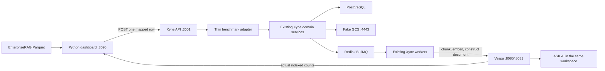

# EnterpriseRAG-Bench through Xyne and Vespa

This local tool ingests the
[EnterpriseRAG-Bench dataset](https://huggingface.co/datasets/onyx-dot-app/EnterpriseRAG-Bench)
through the existing Xyne backend and its normal Vespa workers. The Python dashboard
is a control plane: it reads Parquet rows, submits them to Xyne, displays progress,
and lets us inspect the documents that Xyne has stored in Vespa.

It does **not** chunk documents, create embeddings, construct Vespa documents, or
write directly to Vespa.

## Quick start

The paths below match the current local checkout:

```text
~/Desktop/Repos/vespa-core
~/Desktop/Repos/git/xyne-spaces
~/Downloads/EnterpriseRAG-Bench/documents/test.parquet
```

Start each long-running process in its own terminal.

### 1. Start and deploy local Vespa

```bash
cd ~/Desktop/Repos/vespa-core
scripts/deploy-dev.sh
```

`deploy-dev.sh` starts the Docker container, downloads the selected embedding model
when needed, builds the application package, and deploys the Xyne Vespa schemas.

Verify it:

```bash
curl -fsS http://127.0.0.1:19071/state/v1/health
```

Local Vespa ports:

| Purpose | URL |
| --- | --- |
| Document/feed API | `http://127.0.0.1:8080` |
| Query API | `http://127.0.0.1:8081` |
| Config/admin API | `http://127.0.0.1:19071` |

### 2. Start the Xyne dependencies

The benchmark path needs PostgreSQL, Redis, and fake GCS. Starting only these
services avoids a port collision between Y-Sweet and Vespa on port 8080.

```bash
cd ~/Desktop/Repos/git/xyne-spaces
docker compose -f docker-compose.dev.yml up -d postgres redis fake-gcs
```

For a fresh Xyne checkout, complete the normal repository setup first:

```bash
pnpm install
pnpm run build:shared
pnpm --filter xyne-spaces-backend run db:generate
pnpm --filter xyne-spaces-backend run db:common:generate
pnpm --filter xyne-spaces-backend run db:push
```

See `docs/setup/local-development.md` in `xyne-spaces` for the full application setup.

### 3. Enable the Xyne ingestion routes and workers

Confirm these values in
`~/Desktop/Repos/git/xyne-spaces/apps/backend/.env.local`:

```env
ENABLE_ENTERPRISE_RAG_BENCHMARK_ROUTES=true
ENABLE_VESPA_WORKER=true
ENABLE_VESPA_FILE_WORKER=true
ENABLE_FILE_INDEXING=true

VESPA_FEED_URL=http://127.0.0.1:8080
VESPA_QUERY_URL=http://127.0.0.1:8081
VESPA_CONFIG_SERVER_URL=http://127.0.0.1:19071
FAKE_GCS_HOST=localhost:4443
```

The normal Vespa worker handles messages, mail, and tickets. The file worker handles
knowledge-base documents and transcripts. Both processes are required for the full
dataset.

### 4. Start the Xyne API

```bash
cd ~/Desktop/Repos/git/xyne-spaces
pnpm --filter xyne-spaces-backend run dev
```

Verify it:

```bash
curl -fsS http://127.0.0.1:3001/api/health
```

### 5. Start the Xyne worker

```bash
cd ~/Desktop/Repos/git/xyne-spaces
pnpm --filter xyne-spaces-backend run dev:worker
```

Do not start two workers accidentally. A healthy worker prints messages such as:

```text
[VESPA_WORKER] Processing feed job
Document <id> inserted successfully
[VESPA_FILE_WORKER] VespaFileWorker started successfully
```

### 6. Start the benchmark dashboard

The default Parquet path is already
`~/Downloads/EnterpriseRAG-Bench/documents/test.parquet`.

```bash
cd ~/Desktop/Repos/git/xyne-spaces/enterprise-rag-ingest
python3.12 -m venv .venv
.venv/bin/python -m pip install -r requirements.txt
.venv/bin/python server.py
```

Python 3.12 or 3.13 is recommended. PyArrow may not have a macOS wheel for newer
Python versions.

Open <http://127.0.0.1:8090>, choose a source, start with a small limit such as 10,
and confirm the documents before submitting a large range.

## Downloading the dataset

The current local download is approximately 1.3 GB and contains 511,962 document
rows. If it is missing, use the Hugging Face CLI:

```bash
hf download onyx-dot-app/EnterpriseRAG-Bench \
  --repo-type dataset \
  --local-dir ~/Downloads/EnterpriseRAG-Bench
```

Verify the document file:

```bash
ls -lh ~/Downloads/EnterpriseRAG-Bench/documents/test.parquet
```

To use a different location, set the path when starting the dashboard:

```bash
ENTERPRISE_RAG_PARQUET=/absolute/path/to/test.parquet .venv/bin/python server.py
```

The document Parquet rows contain four fields used by the adapter:

| Field | Meaning |
| --- | --- |
| `doc_id` | Benchmark document identifier |
| `source_type` | Original connector/source name |
| `title` | Document, channel, thread, ticket, or subject title |
| `content` | Full text supplied to the matching Xyne ingestion path |

The adapter adds a stable synthetic ID plus benchmark name, source type, row number,
and original document ID as metadata.

## Architecture



### Responsibility boundary

The benchmark-specific layer:

1. Reads and validates `doc_id`, `source_type`, `title`, and `content`.
2. Classifies the row into a Xyne ingestion path.
3. Generates stable synthetic IDs and required benchmark metadata.
4. Creates the minimum Xyne project/channel/collection containers required by the
   existing domain services.
5. Invokes the matching Xyne service or queue and records the response.

The existing Xyne ingestion system:

1. Creates the normal Xyne message, email, ticket, call, or collection-item records.
2. Stores file/transcript content through Xyne storage.
3. Adds normal BullMQ jobs to Redis.
4. Performs file parsing, chunking, embedding, and Vespa document construction.
5. Writes to the existing Vespa schemas.

There is no benchmark-specific chunker, embedding implementation, or direct Vespa
feed. No Vespa schema change is required.

For document sources, the adapter invokes Xyne storage/repository/queue code inside
the backend; it does not call the public KB HTTP controller. Processing after the
queue boundary is the same Xyne KB worker path.

## Source routing

| Parquet `source_type` | Xyne path | Main Xyne entry point | Vespa schema(s) |
| --- | --- | --- | --- |
| `slack` | Conversation | `conversationService.createConversationWithMessage` | `chat_message` |
| `gmail` | Email and ticket | `emailService.createConversationWithEmail` | `mail`, `ticket` |
| `jira` | Ticket and conversation | `createTicketWithConversation` | `ticket`, `chat_message` |
| `linear` | Ticket and conversation | `createTicketWithConversation` | `ticket`, `chat_message` |
| `fireflies` | Call transcript | Xyne call/storage plus transcript file queue | `file` with transcript sub-app |
| `confluence` | Knowledge base | Xyne collection/storage plus file queue | `file` |
| `github` | Knowledge base | Xyne collection/storage plus file queue | `file` |
| `google_drive` | Knowledge base | Xyne collection/storage plus file queue | `file` |
| `hubspot` | Knowledge base | Xyne collection/storage plus file queue | `file` |

## Understanding the dashboard counters

The large percentage is **submission progress**, not Vespa indexing progress:

```text
submission percentage = attempted rows / requested rows
```

For example, 175,785 attempted Slack rows out of 285,605 selected Slack rows is
61.5%. It means those rows have been sent to the Xyne API.

| Counter | Meaning |
| --- | --- |
| Run percentage | Rows attempted by the Python submitter divided by rows requested |
| Attempted | Backend requests completed, including successes and failures |
| Queued | Xyne accepted the row and created/queued its normal domain work |
| Duplicates | Stable ID already existed; the backend avoided creating a second record |
| Failed | The request did not reach the normal queue successfully |
| Rows ingested | Benchmark source rows confirmed in Vespa by the Xyne stats endpoint |
| Messages/files/mail/tickets | Actual Vespa document counts by schema |
| Dataset rows | All document rows in the Parquet file, not only the selected source |
| Rows left | Full dataset rows minus source rows currently confirmed in Vespa |

The submitter can run near 100 rows/second while one local worker may index only a few
rows per second. A large difference between `Queued` and `Rows ingested` normally
means Redis contains a backlog; it does not by itself mean data was lost.

Stopping the dashboard run stops new submissions. It does **not** remove queued work,
and the Xyne worker continues draining Redis.

## Dashboard endpoints (`http://127.0.0.1:8090`)

| Method | Endpoint | Purpose |
| --- | --- | --- |
| `GET` | `/` | Dashboard UI |
| `GET` | `/health` | Parquet path, backend/Vespa targets, token state, and workspace ID |
| `GET` | `/api/status` | Submission state, failures, rates, ETA, and actual Vespa counts |
| `GET` | `/api/dataset-summary` | Total rows, counts by source, and contiguous row ranges |
| `GET` | `/api/documents?schema=file&limit=20&continuation=...` | List documents through Vespa's document API |
| `GET` | `/api/document?schema=file&doc_id=<id>` | Fetch one actual Vespa document and its fields/chunks |
| `POST` | `/api/start` | Start a range/source submission run |
| `POST` | `/api/stop` | Stop submitting new rows |
| `POST` | `/ingest-one` | Submit one Parquet row by zero-based row index |

Valid browser schemas are `chat_message`, `file`, `mail`, `ticket`, and
`sam_transcript`. `limit` is restricted to 1–50.

### Start a batch

```bash
curl -sS -X POST http://127.0.0.1:8090/api/start \
  -H 'Content-Type: application/json' \
  -d '{
    "source_type": "slack",
    "start_row": 226357,
    "limit": 10,
    "concurrency": 2
  }'
```

`concurrency` must be from 1 through 8. When `source_type` is supplied, the server
constrains the run to that source's row range.

### Stop a batch

```bash
curl -sS -X POST http://127.0.0.1:8090/api/stop \
  -H 'Content-Type: application/json' \
  -d '{}'
```

### Submit one row

```bash
curl -sS -X POST http://127.0.0.1:8090/ingest-one \
  -H 'Content-Type: application/json' \
  -d '{"row_index": 0}'
```

## Xyne benchmark endpoints (`http://127.0.0.1:3001`)

These routes are mounted under `/api/admin/enterprise-rag`.

| Method | Endpoint | Purpose |
| --- | --- | --- |
| `POST` | `/api/admin/enterprise-rag/ingest` | Validate, classify, and submit one mapped row to Xyne |
| `GET` | `/api/admin/enterprise-rag/stats` | Count benchmark resources currently stored in Vespa |
| `GET` | `/api/admin/enterprise-rag/context` | Return the actual org, workspace, and user used by ingestion |

In local development, authentication can be bypassed only for loopback requests when
`ENABLE_ENTERPRISE_RAG_BENCHMARK_ROUTES=true`. Non-loopback or non-development use
requires the normal authenticated Xyne admin token.

The dashboard sends these local identity headers:

```text
X-Workspace-Id
X-Benchmark-Org-Id
X-Benchmark-User-Id
X-User-Name
X-User-Email
Authorization: Bearer <token>   # only when XYNE_API_TOKEN is configured
```

### Direct ingestion request

```bash
curl -sS -X POST http://127.0.0.1:3001/api/admin/enterprise-rag/ingest \
  -H 'Content-Type: application/json' \
  -H 'X-Workspace-Id: enterprise-rag-local' \
  -H 'X-Benchmark-User-Id: enterprise-rag-local-user' \
  -d '{
    "rowIndex": 0,
    "docId": "example-document",
    "sourceType": "confluence",
    "title": "Example document",
    "content": "Example EnterpriseRAG content"
  }'
```

Successful new work returns HTTP `202` with `status: "queued"`. A stable duplicate
returns HTTP `200` with `status: "duplicate"`.

### Read the active context and counts

```bash
curl -sS \
  -H 'X-Workspace-Id: enterprise-rag-local' \
  -H 'X-Benchmark-User-Id: enterprise-rag-local-user' \
  http://127.0.0.1:3001/api/admin/enterprise-rag/context

curl -sS \
  -H 'X-Workspace-Id: enterprise-rag-local' \
  -H 'X-Benchmark-User-Id: enterprise-rag-local-user' \
  http://127.0.0.1:3001/api/admin/enterprise-rag/stats
```

## Relevant Vespa endpoints

The dashboard uses Vespa's document API for inspection because normal search may not
return every document during debugging.

```bash
# List stored message documents
curl -sS \
  'http://127.0.0.1:8080/document/v1/default/chat_message/docid/?cluster=my_content&wantedDocumentCount=20'

# Fetch one message by its Xyne/Vespa document ID
curl -sS \
  'http://127.0.0.1:8080/document/v1/default/chat_message/docid/<document-id>'

# Fetch one KB/transcript file and inspect its chunks
curl -sS \
  'http://127.0.0.1:8080/document/v1/default/file/docid/<document-id>'
```

The document ID here is the Xyne entity ID returned as `entityIds`, not the original
EnterpriseRAG `doc_id`. The original ID and Parquet row are retained in metadata.

## Configuration reference

Dashboard configuration is supplied through environment variables:

| Variable | Default | Purpose |
| --- | --- | --- |
| `ENTERPRISE_RAG_PARQUET` | `~/Downloads/EnterpriseRAG-Bench/documents/test.parquet` | Document Parquet path |
| `XYNE_BACKEND_URL` | `http://127.0.0.1:3001` | Xyne API target |
| `XYNE_API_TOKEN` | empty | Required outside the local-development loopback bypass |
| `XYNE_WORKSPACE_ID` | random per dashboard process | Requested local workspace identity |
| `XYNE_ORG_ID` | derived from workspace | Requested local organization identity |
| `XYNE_USER_ID` | derived from workspace | Requested local user identity |
| `XYNE_USER_NAME` | `EnterpriseRAG Admin` | Synthetic local user name |
| `XYNE_USER_EMAIL` | `enterprise-rag@example.com` | Synthetic local user email header |
| `VESPA_DOCUMENT_URL` | `http://127.0.0.1:8080` | Direct document-inspection target |
| `VESPA_CLUSTER` | `my_content` | Vespa content cluster used for document listing |
| `VESPA_NAMESPACE` | `default` | Vespa document namespace |
| `INGEST_HOST` | `127.0.0.1` | Dashboard bind address |
| `INGEST_PORT` | `8090` | Dashboard port |

The backend may resolve an existing active local Xyne user instead of scaffolding the
requested synthetic identity. Treat `/api/admin/enterprise-rag/context` and the
workspace displayed by the dashboard as the authoritative identity.

ASK AI must run in that same workspace. Workspace isolation intentionally prevents a
different workspace from retrieving these benchmark documents.

## Verification workflow

Before a large run:

1. Submit one row using `/ingest-one` or a batch limit of 1.
2. Confirm the Xyne worker logs show the job was completed.
3. Check `/api/admin/enterprise-rag/stats` until the relevant schema count increases.
4. Copy the returned Xyne entity ID and fetch it from Vespa's document API.
5. For a `file` document, confirm `fields.chunks` is populated.
6. Confirm ASK AI uses the workspace returned by the context endpoint.

For a live run:

```bash
curl -sS http://127.0.0.1:8090/api/status
```

Use `attempted`, `queued`, `duplicates`, and `failed` to monitor submission. Use
`vespa_source_rows` and `vespa_by_schema` to monitor completed indexing.

## Resume and duplicate behavior

Progress is persisted in the ignored `progress.json` file next to `server.py`. If the
dashboard stops while a run is active, the restored state becomes `interrupted`.

To resume, start a new run at the next desired Parquet row. Stable IDs make repeated
submissions idempotent for normal messages, mail, and tickets. Knowledge-base items
may be requeued so an existing file can be indexed again.

## Troubleshooting

### High submission percentage but low message count

This means the producer is ahead of the worker. The percentage tracks HTTP submission,
whereas message/file/mail/ticket counts track completed Vespa documents. Keep the
worker running and let it drain Redis. Lower dashboard concurrency for a smaller
backlog; increasing dashboard concurrency does not make Vespa indexing faster.

### `XYNE_API_TOKEN is not configured`

For local loopback development, make sure all of these are true:

```text
NODE_ENV=development
ENABLE_ENTERPRISE_RAG_BENCHMARK_ROUTES=true
XYNE_BACKEND_URL=http://127.0.0.1:3001
```

No token is required in that case. A remote, sandbox, or production backend requires
the normal Xyne admin token.

### PostgreSQL rejects `invalid byte sequence for encoding UTF8: 0x00`

Some benchmark content contains a NUL character. PostgreSQL rejects that row before it
can be queued. The dashboard records it under `failed`; it must be sanitized and
retried. Do not count it as queued or indexed.

### Backend request timeout

Check the API process, PostgreSQL, Redis, and backend logs. A timeout is recorded as a
failed submission and should be retried after the backend is healthy.

### File jobs do not progress

Verify fake GCS and the file worker:

```bash
docker compose -f ~/Desktop/Repos/git/xyne-spaces/docker-compose.dev.yml ps fake-gcs
curl -fsS http://127.0.0.1:4443/storage/v1/b
```

Also confirm `ENABLE_VESPA_FILE_WORKER=true` and `ENABLE_FILE_INDEXING=true` before
starting the worker.

### Messages do not progress

Confirm `ENABLE_VESPA_WORKER=true`, Redis is running, and only one intended local
worker is consuming the queue.

### Vespa document lookup returns 404

Wait for the worker completion log, verify the schema, and use the returned Xyne
`entityIds` value rather than the EnterpriseRAG `doc_id`.

## Stopping the stack

Stop the dashboard, API, and worker with `Ctrl-C` in their terminals. Stop the Xyne
dependency containers without deleting their volumes:

```bash
cd ~/Desktop/Repos/git/xyne-spaces
docker compose -f docker-compose.dev.yml stop postgres redis fake-gcs
```

Stop local Vespa without deleting its data volume:

```bash
cd ~/Desktop/Repos/vespa-core/deployment
docker compose -f docker-compose.dev.yml down
```

Do not add `-v` unless a complete local-data reset is intended.
